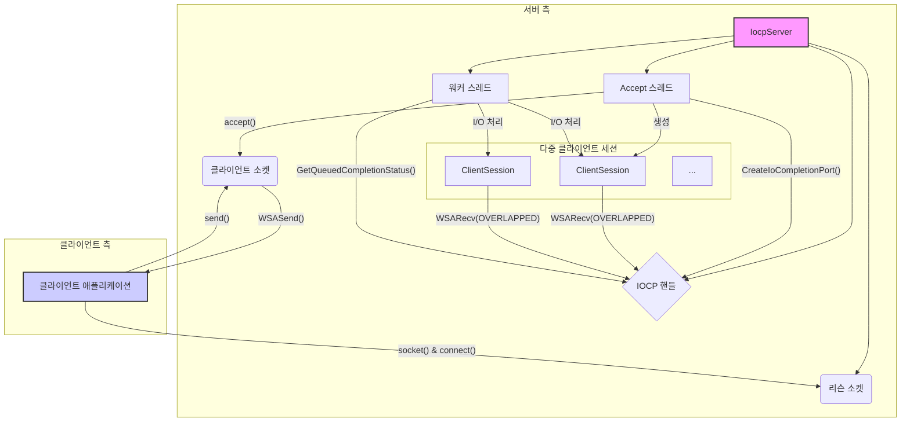

# IOCPFramework

## 프로젝트 구조

### 핵심 구성 요소
- **네트워크 계층** - IOCP 기반 네트워킹
- **세션 관리** - 클라이언트 연결 관리
- **패킷 처리** - 직렬화/역직렬화, 프로토콜 정의
- **게임 로직** - 게임 플레이 핵심 기능
- **메모리 풀** - 성능 최적화를 위한 메모리 관리
- **스레드 풀** - 멀티스레딩 관리
- **로깅 시스템** - 디버깅 및 모니터링
- **DB 연동** - 게임 데이터 저장

### 폴더 구조
```
IOCPFramework/
├── server/
│   ├── core/           # 핵심 엔진 코드
│   │   ├── network/    # IOCP, Session, Socket 관리
│   │   ├── memory/     # 메모리 풀, 할당자
│   │   ├── thread/     # 스레드 풀, 작업 큐
│   │   └── utils/      # 유틸리티 함수들
│   ├── protocol/       # 패킷 정의, 직렬화
│   ├── game/           # 게임 로직
│   │   ├── entities/   # 게임 오브젝트
│   │   ├── systems/    # 게임 시스템 (이동, 전투 등)
│   │   └── world/      # 월드, 맵 관리
│   ├── database/       # DB 연동 코드
│   └── tools/          # 디버깅, 모니터링 도구
├── client/             # 클라이언트 코드
├── shared/             # 서버-클라이언트 공통 코드
│   ├── protocol/       # 패킷 정의
│   └── common/         # 공통 유틸리티
└── tests/              # 테스트 코드
```

## 아키텍처 구조도

