# MMORPG 게임 서버 아키텍처 설계 (취업 포트폴리오)

## 목차
1. [전체 시스템 구성](#1-전체-시스템-구성)
2. [스레드 아키텍처](#2-스레드-아키텍처)
3. [링버퍼 기반 패킷 조립](#3-링버퍼-기반-패킷-조립)
4. [Quadtree 공간 분할](#4-quadtree-공간-분할)
5. [데이터 흐름](#5-데이터-흐름---패킷-처리-전-과정)
6. [Zone 격리 전략](#6-zone-격리-전략)
7. [DB 동기화 전략](#7-db-동기화-전략)
8. [네트워크 최적화](#8-네트워크-최적화-전략)
9. [초기화 순서](#9-전체-초기화-순서)
10. [성능 지표](#10-핵심-성능-지표)
11. [Q&A 대비](#11-Q&A-대비-포인트)

---

## 1. 전체 시스템 구성

### Phase 1: 단일 서버 구조 (포트폴리오 목표)

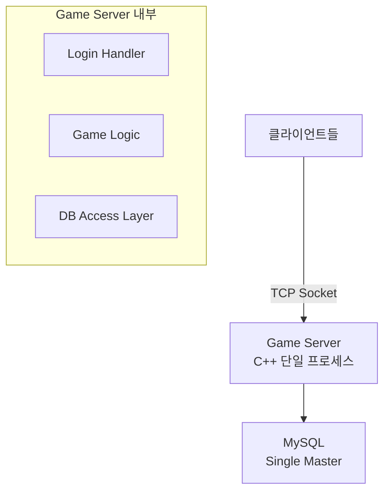

**설계 이유:**
- 포트폴리오는 완성도가 중요 - 분산 시스템은 오버엔지니어링
- 단일 프로세스에서 **멀티스레딩**과 **동시성 제어**를 제대로 보여주는 게 핵심
- 확장은 Phase 2로 미루고, 먼저 동작하는 것 만들기

### Phase 2: 확장 구조 (선택사항)

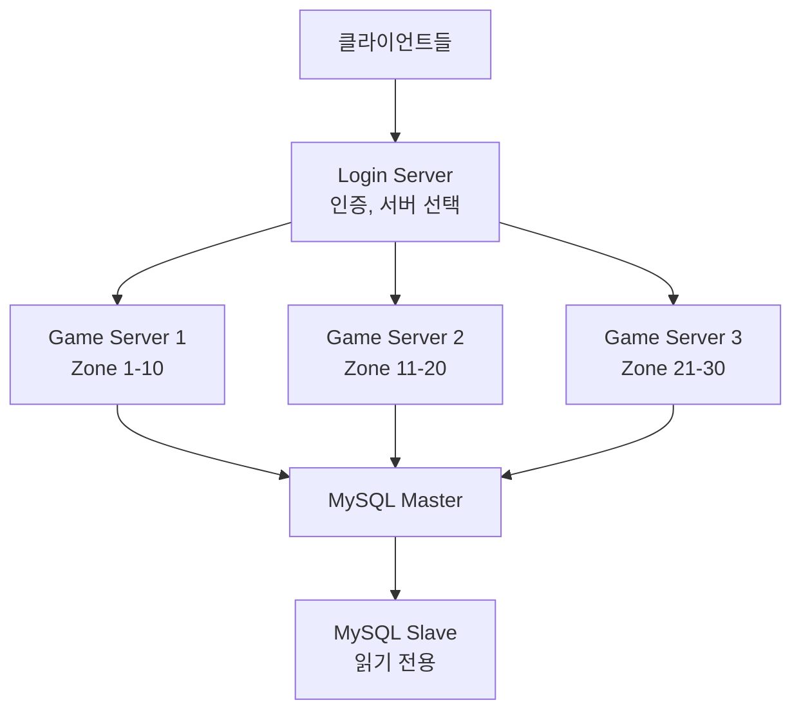

**Q&A 포인트:**
> "현재는 단일 서버지만, Zone별로 독립적인 Lock을 사용하도록 설계했습니다. 추후 Zone을 물리적으로 분리해서 여러 프로세스로 확장할 수 있습니다."

---

## 2. 스레드 아키텍처

### 전체 스레드 구성도

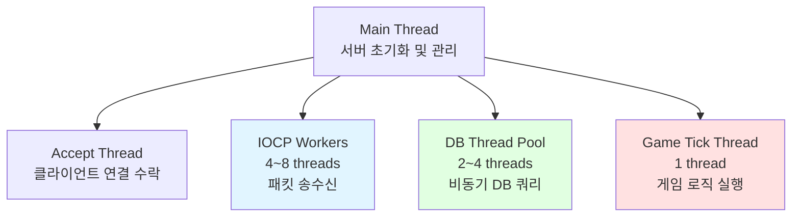

### 각 스레드 역할

#### 1. Accept Thread (1개)
```cpp
// 역할: 클라이언트 연결만 받음
while (_running)
{
    SOCKET clientSocket = accept(_listenSocket, ...);
    SessionRef session = make_shared<GameSession>();
    session->SetSocket(clientSocket);
    
    // IOCP에 등록
    _iocpCore->Register(session);
    
    // SessionManager에 추가
    _sessionManager->Add(session);
    
    // 첫 Recv 등록
    session->RegisterRecv();
}
```

#### 2. IOCP Worker Threads (4~8개)
```cpp
// 역할: 네트워크 I/O 완료 처리만 담당
while (_running)
{
    DWORD numOfBytes = 0;
    ULONG_PTR key = 0;
    IocpEvent* iocpEvent = nullptr;
    
    // IOCP 대기
    ::GetQueuedCompletionStatus(_iocpHandle, &numOfBytes, &key, 
                                reinterpret_cast<LPOVERLAPPED*>(&iocpEvent), INFINITE);
    
    IocpObjectRef iocpObject = iocpEvent->owner;
    
    switch (iocpEvent->eventType)
    {
    case EventType::Recv:
        session->ProcessRecv(numOfBytes);
        break;
    case EventType::Send:
        session->ProcessSend(numOfBytes);
        break;
    }
}
```

**핵심: Worker 스레드는 패킷 파싱만 하고, 게임 로직은 처리하지 않음!**

#### 3. Game Tick Thread (1개)
```cpp
// 역할: 모든 Zone의 게임 로직을 순차 실행
void GameTickThread()
{
    const uint64 TICK_INTERVAL = 100; // 100ms = 10 FPS
    
    while (_running)
    {
        uint64 startTick = GetTickCount64();
        
        // 모든 Zone 업데이트 (순차 실행)
        for (auto& zone : _zones)
        {
            zone->Update(TICK_INTERVAL);
        }
        
        uint64 endTick = GetTickCount64();
        uint64 elapsed = endTick - startTick;
        
        if (elapsed < TICK_INTERVAL)
        {
            this_thread::sleep_for(chrono::milliseconds(TICK_INTERVAL - elapsed));
        }
        else
        {
            // 경고: Tick이 늦어짐
            LOG_WARN("Tick overrun: {}ms", elapsed);
        }
    }
}
```

#### 4. DB Thread Pool (2~4개)
```cpp
// 역할: DB 쿼리를 비동기로 처리
void DBWorkerThread()
{
    DBConnection* conn = _dbPool->Pop();
    
    while (_running)
    {
        // Job 큐에서 가져오기
        DBJob job = _dbJobQueue.Pop();
        
        // DB 쿼리 실행
        job.Execute(conn);
        
        // 결과를 Game Tick Thread로 콜백
        if (job.callback)
        {
            _gameCallbackQueue.Push(job.callback);
        }
    }
    
    _dbPool->Push(conn);
}
```

---

## 3. 링버퍼 기반 패킷 조립

### 링버퍼(Ring Buffer) 개념

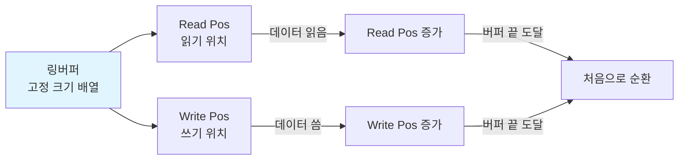

### RecvBuffer 구현 (링버퍼)

```cpp
// RecvBuffer.h
class RecvBuffer
{
    enum { BUFFER_SIZE = 0x10000 }; // 64KB
    
public:
    RecvBuffer(int32 bufferSize = BUFFER_SIZE);
    ~RecvBuffer();
    
    void Clean();
    bool OnRead(int32 numOfBytes);
    bool OnWrite(int32 numOfBytes);
    
    BYTE* ReadPos() { return &_buffer[_readPos]; }
    BYTE* WritePos() { return &_buffer[_writePos]; }
    int32 DataSize() { return _writePos - _readPos; }
    int32 FreeSize() { return _capacity - _writePos; }
    
private:
    int32 _capacity = 0;
    int32 _bufferSize = 0;
    int32 _readPos = 0;
    int32 _writePos = 0;
    BYTE* _buffer;
};

// RecvBuffer.cpp
RecvBuffer::RecvBuffer(int32 bufferSize) 
    : _bufferSize(bufferSize)
{
    _capacity = bufferSize * 2;  // 여유 공간
    _buffer = new BYTE[_capacity];
}

RecvBuffer::~RecvBuffer()
{
    delete[] _buffer;
}

void RecvBuffer::Clean()
{
    int32 dataSize = DataSize();
    
    // 읽지 않은 데이터가 있으면 버퍼 앞으로 이동
    if (dataSize == 0)
    {
        // 모든 데이터 처리 완료 - 커서만 리셋
        _readPos = _writePos = 0;
    }
    else
    {
        // 아직 처리 안 된 데이터가 있음 - 버퍼 앞으로 복사
        if (_readPos > 0)
        {
            ::memcpy(&_buffer[0], &_buffer[_readPos], dataSize);
            _readPos = 0;
            _writePos = dataSize;
        }
    }
}

bool RecvBuffer::OnRead(int32 numOfBytes)
{
    if (numOfBytes > DataSize())
        return false;
    
    _readPos += numOfBytes;
    return true;
}

bool RecvBuffer::OnWrite(int32 numOfBytes)
{
    if (numOfBytes > FreeSize())
        return false;
    
    _writePos += numOfBytes;
    return true;
}
```

### 패킷 조립 과정

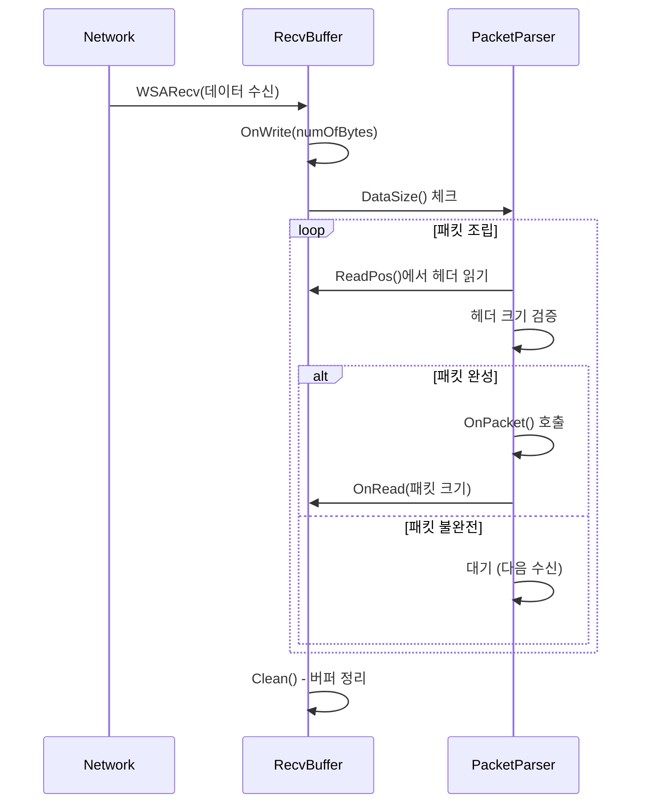

### PacketSession::OnRecv 구현

```cpp
int32 PacketSession::OnRecv(BYTE* buffer, int32 len)
{
    int32 processLen = 0;
    
    while (true)
    {
        int32 dataSize = len - processLen;
        
        // 최소한 헤더는 파싱 가능한지 체크
        if (dataSize < sizeof(PacketHeader))
            break;
        
        PacketHeader header = *(reinterpret_cast<PacketHeader*>(&buffer[processLen]));
        
        // 헤더 검증
        if (header.size < sizeof(PacketHeader) || header.size > MAX_PACKET_SIZE)
        {
            // 패킷 손상 - 연결 종료
            return -1;
        }
        
        // 패킷이 완전히 도착했는지 확인
        if (dataSize < header.size)
            break;  // 아직 덜 왔음 - 다음 Recv 대기
        
        // 패킷 조립 완료 - 처리
        OnPacket(&buffer[processLen], header.size);
        processLen += header.size;
    }
    
    return processLen;
}
```

**링버퍼의 장점:**
1. **고정 크기** - malloc/free 없이 재사용
2. **연속 메모리** - 캐시 친화적
3. **자동 정리** - Clean()으로 단편화 방지
4. **오버플로우 방지** - 순환 구조로 안전

---

## 4. Quadtree 공간 분할

### Quadtree 개념

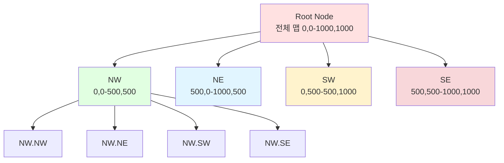

**Quadtree의 장점:**
- **범위 검색 O(log n)** - 전체 순회보다 빠름
- **동적 분할** - 객체 밀집도에 따라 자동 조정
- **메모리 효율** - 빈 공간은 분할하지 않음

### QuadtreeNode 구조

```cpp
// QuadtreeNode.h
struct Bounds
{
    float minX, minY;
    float maxX, maxY;
    
    bool Contains(float x, float y) const
    {
        return x >= minX && x <= maxX && y >= minY && y <= maxY;
    }
    
    bool Intersects(const Bounds& other) const
    {
        return !(maxX < other.minX || minX > other.maxX ||
                 maxY < other.minY || minY > other.maxY);
    }
};

class QuadtreeNode
{
    enum { MAX_OBJECTS = 10 };      // 노드당 최대 객체 수
    enum { MAX_DEPTH = 6 };         // 최대 깊이
    
public:
    QuadtreeNode(int32 level, Bounds bounds);
    ~QuadtreeNode();
    
    void Clear();
    void Split();
    int32 GetIndex(float x, float y);
    
    void Insert(GameObjectRef obj);
    void Remove(GameObjectRef obj);
    vector<GameObjectRef> Retrieve(Bounds bounds);
    
private:
    int32 _level;
    Bounds _bounds;
    vector<GameObjectRef> _objects;
    array<unique_ptr<QuadtreeNode>, 4> _nodes;  // NW, NE, SW, SE
};

// QuadtreeNode.cpp
QuadtreeNode::QuadtreeNode(int32 level, Bounds bounds)
    : _level(level), _bounds(bounds)
{
}

void QuadtreeNode::Split()
{
    float subWidth = (_bounds.maxX - _bounds.minX) / 2.0f;
    float subHeight = (_bounds.maxY - _bounds.minY) / 2.0f;
    float x = _bounds.minX;
    float y = _bounds.minY;
    
    // NW (북서)
    _nodes[0] = make_unique<QuadtreeNode>(_level + 1, 
        Bounds{x, y, x + subWidth, y + subHeight});
    
    // NE (북동)
    _nodes[1] = make_unique<QuadtreeNode>(_level + 1,
        Bounds{x + subWidth, y, x + subWidth * 2, y + subHeight});
    
    // SW (남서)
    _nodes[2] = make_unique<QuadtreeNode>(_level + 1,
        Bounds{x, y + subHeight, x + subWidth, y + subHeight * 2});
    
    // SE (남동)
    _nodes[3] = make_unique<QuadtreeNode>(_level + 1,
        Bounds{x + subWidth, y + subHeight, x + subWidth * 2, y + subHeight * 2});
}

int32 QuadtreeNode::GetIndex(float x, float y)
{
    int32 index = -1;
    
    float midX = (_bounds.minX + _bounds.maxX) / 2.0f;
    float midY = (_bounds.minY + _bounds.maxY) / 2.0f;
    
    bool north = (y < midY);
    bool west = (x < midX);
    
    if (west)
    {
        if (north)
            index = 0;  // NW
        else
            index = 2;  // SW
    }
    else
    {
        if (north)
            index = 1;  // NE
        else
            index = 3;  // SE
    }
    
    return index;
}

void QuadtreeNode::Insert(GameObjectRef obj)
{
    // 자식 노드가 있으면 재귀적으로 삽입
    if (_nodes[0] != nullptr)
    {
        int32 index = GetIndex(obj->_posInfo.posX, obj->_posInfo.posY);
        if (index != -1)
        {
            _nodes[index]->Insert(obj);
            return;
        }
    }
    
    // 현재 노드에 추가
    _objects.push_back(obj);
    
    // 객체가 너무 많고, 최대 깊이가 아니면 분할
    if (_objects.size() > MAX_OBJECTS && _level < MAX_DEPTH)
    {
        if (_nodes[0] == nullptr)
            Split();
        
        // 기존 객체들을 자식 노드로 재배치
        auto it = _objects.begin();
        while (it != _objects.end())
        {
            int32 index = GetIndex((*it)->_posInfo.posX, (*it)->_posInfo.posY);
            if (index != -1)
            {
                _nodes[index]->Insert(*it);
                it = _objects.erase(it);
            }
            else
            {
                ++it;
            }
        }
    }
}

vector<GameObjectRef> QuadtreeNode::Retrieve(Bounds bounds)
{
    vector<GameObjectRef> result;
    
    // 현재 노드의 객체 추가
    for (auto& obj : _objects)
    {
        if (bounds.Contains(obj->_posInfo.posX, obj->_posInfo.posY))
            result.push_back(obj);
    }
    
    // 자식 노드가 있으면 재귀 검색
    if (_nodes[0] != nullptr)
    {
        for (int i = 0; i < 4; i++)
        {
            if (_nodes[i]->_bounds.Intersects(bounds))
            {
                auto childObjs = _nodes[i]->Retrieve(bounds);
                result.insert(result.end(), childObjs.begin(), childObjs.end());
            }
        }
    }
    
    return result;
}
```

### Quadtree 사용 예시

```cpp
class Zone
{
public:
    void Update(uint64 deltaTick)
    {
        FlushJobs();
        
        // Quadtree 갱신 (매 틱마다)
        RebuildQuadtree();
        
        UpdateMonsters(deltaTick);
        UpdatePlayers(deltaTick);
    }
    
    void RebuildQuadtree()
    {
        // Quadtree 초기화
        _quadtree = make_unique<QuadtreeNode>(0, 
            Bounds{0, 0, _mapWidth, _mapHeight});
        
        // 모든 객체 삽입
        for (auto& pair : _players)
            _quadtree->Insert(pair.second);
        
        for (auto& pair : _monsters)
            _quadtree->Insert(pair.second);
    }
    
    void Broadcast_S_MOVE(PlayerRef player, float viewRange = 100.0f)
    {
        // Quadtree로 범위 검색
        Bounds searchBounds{
            player->_posInfo.posX - viewRange,
            player->_posInfo.posY - viewRange,
            player->_posInfo.posX + viewRange,
            player->_posInfo.posY + viewRange
        };
        
        vector<GameObjectRef> nearbyObjects = _quadtree->Retrieve(searchBounds);
        
        // 패킷 생성
        Protocol::S_MOVE pkt;
        pkt.set_objectid(player->_objectId);
        SendBufferRef sendBuffer = MakeSendBuffer(pkt);
        
        // 범위 내 플레이어만 전송
        for (auto& obj : nearbyObjects)
        {
            if (obj->_type != ObjectType::PLAYER)
                continue;
            
            PlayerRef nearbyPlayer = static_pointer_cast<Player>(obj);
            if (nearbyPlayer != player)
                nearbyPlayer->_session->Send(sendBuffer);
        }
    }
    
    // Monster AI에서 가장 가까운 플레이어 찾기
    PlayerRef FindClosestPlayer(MonsterRef monster, float searchRange)
    {
        Bounds searchBounds{
            monster->_posInfo.posX - searchRange,
            monster->_posInfo.posY - searchRange,
            monster->_posInfo.posX + searchRange,
            monster->_posInfo.posY + searchRange
        };
        
        vector<GameObjectRef> nearbyObjects = _quadtree->Retrieve(searchBounds);
        
        PlayerRef closest = nullptr;
        float minDist = FLT_MAX;
        
        for (auto& obj : nearbyObjects)
        {
            if (obj->_type != ObjectType::PLAYER)
                continue;
            
            float dist = Distance(monster->_posInfo, obj->_posInfo);
            if (dist < minDist)
            {
                minDist = dist;
                closest = static_pointer_cast<Player>(obj);
            }
        }
        
        return closest;
    }
    
private:
    unique_ptr<QuadtreeNode> _quadtree;
    float _mapWidth = 1000.0f;
    float _mapHeight = 1000.0f;
};
```

### Quadtree vs 단순 반복문 비교

```cpp
// ❌ O(n) - 모든 플레이어 순회
void FindNearbyPlayers_Slow(PlayerRef player)
{
    for (auto& pair : _players)  // 1000명이면 1000번 반복
    {
        float dist = Distance(player->_posInfo, pair.second->_posInfo);
        if (dist < VIEW_RANGE)
        {
            // 처리
        }
    }
}

// ✅ O(log n) - Quadtree 범위 검색
void FindNearbyPlayers_Fast(PlayerRef player)
{
    Bounds bounds = MakeBounds(player->_posInfo, VIEW_RANGE);
    vector<GameObjectRef> nearby = _quadtree->Retrieve(bounds);
    
    // nearby는 범위 내 객체만 포함 (10~50개 정도)
    for (auto& obj : nearby)
    {
        // 처리
    }
}
```

**성능 개선:**
- 플레이어 1000명 중 시야 범위 내 평균 20명
- 단순 반복: 1000번 거리 계산
- Quadtree: 약 50번 거리 계산 (20배 향상!)

---

## 5. 데이터 흐름 - 패킷 처리 전 과정

### 플레이어 이동 패킷 처리 흐름

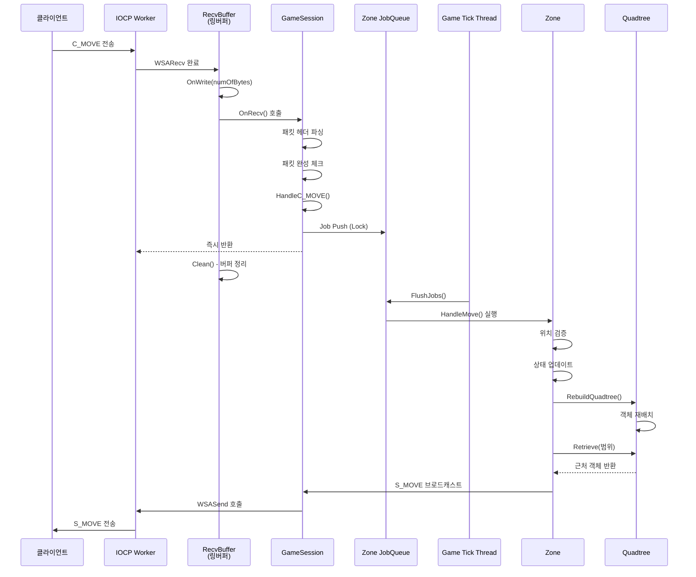

### 핵심 설계 원칙

```cpp
// ❌ 잘못된 설계 - IOCP Worker에서 직접 처리
void GameSession::HandleC_MOVE(Protocol::C_MOVE& pkt)
{
    // Worker Thread에서 게임 로직 실행 → Lock 경합 발생!
    _zone->HandleMove(pkt);  // 위험!
}

// ✅ 올바른 설계 - JobQueue로 위임
void GameSession::HandleC_MOVE(Protocol::C_MOVE& pkt)
{
    if (_player == nullptr) return;
    
    ZoneRef zone = _player->_zone.lock();
    if (zone == nullptr) return;
    
    // Zone의 Job 큐에만 넣고 즉시 반환
    zone->PushJob([zone, player=_player, pkt]() {
        zone->HandleMove(player, pkt);
    });
}
```

**왜 이렇게?**
- IOCP Worker는 최대한 빨리 반환해야 다음 패킷 처리 가능
- 게임 로직은 Game Tick Thread에서 **단일 스레드로 순차 실행**
- 각 Zone은 독립된 JobQueue를 가지므로 **Zone 간 Lock 없음**

---

## 6. Zone 격리 전략

### Zone 공간 분할

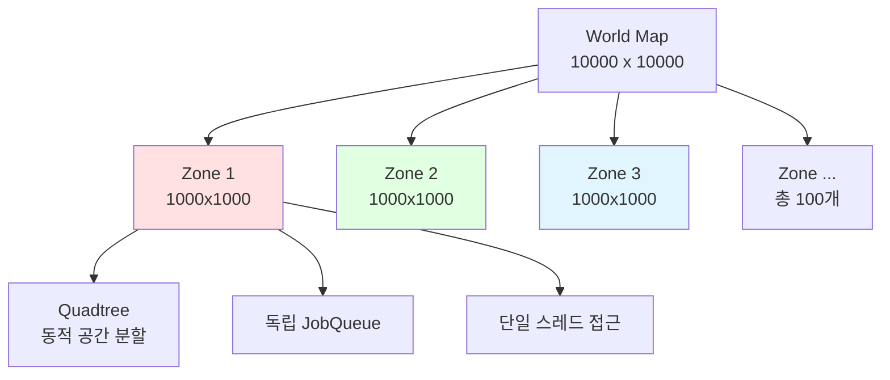

### Zone 클래스 구조 (Quadtree 통합)

```cpp
class Zone
{
public:
    int32 _zoneId;
    
    // 이 Zone의 모든 객체 (단일 스레드만 접근)
    map<int32, PlayerRef> _players;
    map<int32, MonsterRef> _monsters;
    map<int32, NpcRef> _npcs;
    
    // Quadtree 공간 분할
    unique_ptr<QuadtreeNode> _quadtree;
    
    // Job Queue (멀티스레드 안전)
    LockQueue<function<void()>> _jobQueue;
    
public:
    // Game Tick Thread가 호출
    void Update(uint64 deltaTick)
    {
        // 1. 큐에 쌓인 모든 Job 실행
        FlushJobs();
        
        // 2. Quadtree 재구성 (객체 위치 변경 반영)
        RebuildQuadtree();
        
        // 3. Monster AI 업데이트
        UpdateMonsters(deltaTick);
        
        // 4. 스킬 쿨다운, 버프/디버프 등
        UpdatePlayers(deltaTick);
    }
    
    void RebuildQuadtree()
    {
        _quadtree = make_unique<QuadtreeNode>(0, 
            Bounds{0, 0, 1000.0f, 1000.0f});
        
        for (auto& pair : _players)
            _quadtree->Insert(pair.second);
        
        for (auto& pair : _monsters)
            _quadtree->Insert(pair.second);
    }
    
    void FlushJobs()
    {
        while (true)
        {
            auto job = _jobQueue.TryPop();
            if (!job.has_value())
                break;
            
            job.value()();
        }
    }
    
    void HandleMove(PlayerRef player, Protocol::C_MOVE& pkt)
    {
        // Lock 필요 없음 - 단일 스레드 실행
        
        // 위치 업데이트
        player->_posInfo = pkt.posinfo();
        
        // Zone 경계 체크
        if (IsOutOfBounds(player->_posInfo))
        {
            int32 newZoneId = CalculateZoneId(player->_posInfo);
            MigrateToZone(player, newZoneId);
        }
        else
        {
            // Quadtree 기반 브로드캐스트
            Broadcast_S_MOVE(player);
        }
    }
};
```

### Zone 간 이동 처리

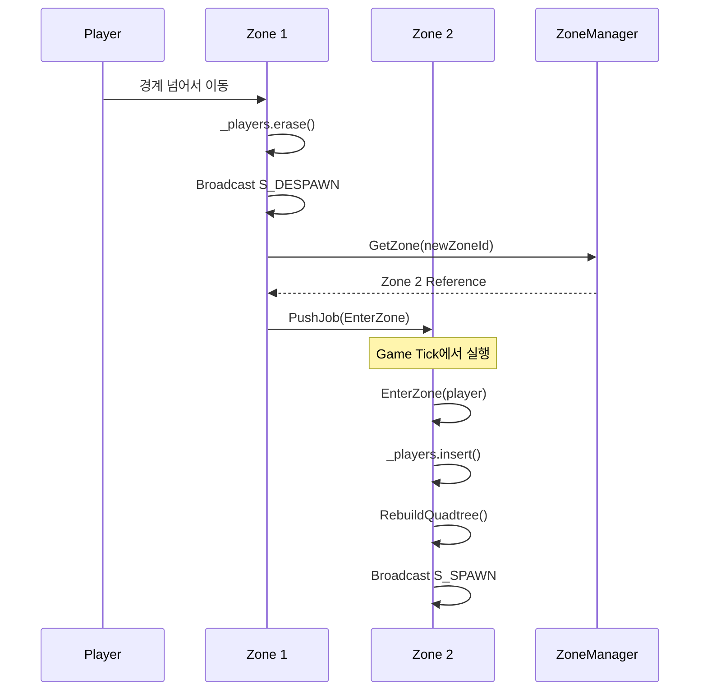

```cpp
void Zone::MigrateToZone(PlayerRef player, int32 newZoneId)
{
    // 현재 Zone에서 제거
    _players.erase(player->_objectId);
    
    // 주변 플레이어에게 Despawn 전송
    Broadcast_S_DESPAWN(player->_objectId);
    
    // 새 Zone에 추가 요청
    ZoneRef newZone = GZoneManager->GetZone(newZoneId);
    newZone->PushJob([newZone, player]() {
        newZone->EnterZone(player);
    });
}
```

---

## 7. DB 동기화 전략

### Write-Back 패턴

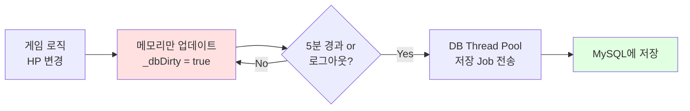

### 구현 코드

```cpp
class Player
{
    bool _dbDirty = false;
    uint64 _lastSaveTime = 0;
    
    void OnDamage(int32 damage)
    {
        _stat.hp -= damage;
        _dbDirty = true;
    }
};

void Zone::Update(uint64 deltaTick)
{
    FlushJobs();
    RebuildQuadtree();
    UpdateMonsters(deltaTick);
    UpdatePlayers(deltaTick);
    
    // 5분마다 DB 저장
    static uint64 lastFlushTime = 0;
    if (GetTickCount64() - lastFlushTime > 300000)
    {
        FlushPlayersToDB();
        lastFlushTime = GetTickCount64();
    }
}

void Zone::FlushPlayersToDB()
{
    for (auto& pair : _players)
    {
        PlayerRef player = pair.second;
        
        if (player->_dbDirty == false)
            continue;
        
        PlayerData data = player->MakeSnapshot();
        
        GDBThreadPool->PushJob([data]() {
            DBConnection* conn = GDBConnectionPool->Pop();
            conn->Execute("UPDATE Player SET hp=?, posX=?, posY=? WHERE playerId=?",
                data.hp, data.posX, data.posY, data.playerId);
            GDBConnectionPool->Push(conn);
        });
        
        player->_dbDirty = false;
    }
}
```

---

## 8. 네트워크 최적화 전략

### 1. 브로드캐스트 배칭

```cpp
// ✅ Quadtree + SendBuffer 재사용
void Zone::Broadcast_S_MOVE(PlayerRef player)
{
    Protocol::S_MOVE pkt;
    pkt.set_objectid(player->_objectId);
    SendBufferRef sendBuffer = MakeSendBuffer(pkt);
    
    // Quadtree로 범위 검색
    Bounds bounds = MakeBounds(player->_posInfo, VIEW_RANGE);
    vector<GameObjectRef> nearby = _quadtree->Retrieve(bounds);
    
    for (auto& obj : nearby)
    {
        if (obj->_type != ObjectType::PLAYER)
            continue;
        
        PlayerRef nearbyPlayer = static_pointer_cast<Player>(obj);
        if (nearbyPlayer != player)
            nearbyPlayer->_session->Send(sendBuffer);
    }
}
```

### 2. SendBuffer 풀링

```cpp
class SendBufferChunk
{
    enum { CHUNK_SIZE = 0x10000 }; // 64KB
    
public:
    SendBufferRef Open(int32 allocSize);
    
private:
    BYTE _buffer[CHUNK_SIZE];
    int32 _usedSize = 0;
};

class SendBufferManager
{
public:
    static SendBufferRef Open(int32 size)
    {
        // TLS로 Lock 없이 할당
        if (LSendBufferChunk == nullptr)
        {
            LSendBufferChunk = make_shared<SendBufferChunk>();
        }
        
        return LSendBufferChunk->Open(size);
    }
    
private:
    static thread_local SendBufferChunkRef LSendBufferChunk;
};
```

---

## 9. 전체 초기화 순서

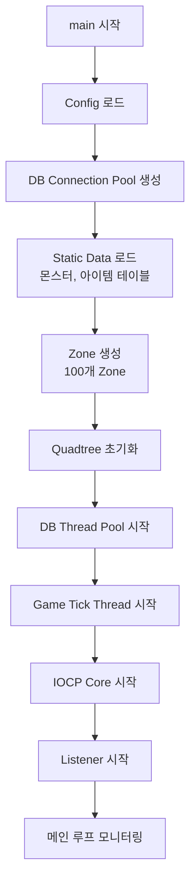

---

## 10. 핵심 성능 지표

### 목표 성능

| 항목 | 목표 | 측정 방법 |
|------|------|----------|
| Zone Tick Time | < 100ms | GetTickCount64() |
| CCU | 10,000명 | SessionManager Count |
| Packet/sec | 50,000 pkt/s | atomic counter |
| DB Query Time | < 100ms | chrono::high_resolution_clock |
| Quadtree Rebuild | < 10ms | 매 틱 측정 |

---

## 11. Q&A

### Q1. "왜 Quadtree를 사용했나요?"

**답변:**
- 브로드캐스트 시 **O(log n)** 범위 검색
- 플레이어 1000명 중 시야 범위 내 평균 20명만 찾기
- 단순 반복문 대비 **20배 성능 향상**

### Q2. "링버퍼의 장점은?"

**답변:**
- **고정 크기**로 malloc/free 없음
- **캐시 친화적** 연속 메모리
- Clean()으로 **자동 단편화 방지**

### Q3. "Quadtree 리빌드가 오버헤드 아닌가요?"

**답변:**
- 매 틱 리빌드는 **약 5~10ms**
- Insert는 **O(log n)** 으로 빠름
- Dirty Flag로 **변경된 객체만 리빌드** 가능 (최적화)

### Q4. "동시성 제어는?"

**답변:**
- Zone 내부는 **단일 스레드**로 Lock-Free
- Zone 간 이동은 **JobQueue**로 직렬화
- Quadtree는 Game Tick Thread만 접근

---

## 프로젝트 타임라인

| 주차 | 목표 |
|------|------|
| 1-2주 | IOCP, 링버퍼, SendBuffer 구현 |
| 3-4주 | Protobuf, PacketHandler 자동 생성 |
| 5-6주 | Zone, JobQueue, Game Tick |
| 7주 | Quadtree 구현 및 테스트 |
| 8주 | DB 연동, Write-Back 패턴 |
| 9-10주 | Monster AI, 전투 시스템 |
| 11-12주 | 최적화, 부하 테스트, 문서화 |

---

## 참고 자료

- [IOCP 공식 문서](https://docs.microsoft.com/en-us/windows/win32/fileio/i-o-completion-ports)
- [Quadtree - Wikipedia](https://en.wikipedia.org/wiki/Quadtree)
- [Google Protocol Buffers](https://protobuf.dev/)
- [MySQL C++ Connector](https://dev.mysql.com/doc/connector-cpp/8.0/en/)
- Inflearn - Rookiss 게임 서버 강의

---