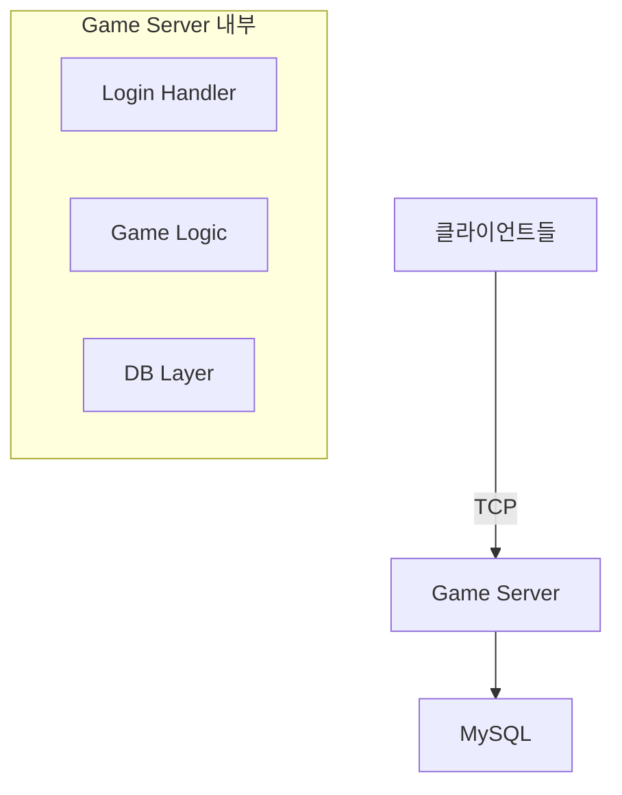
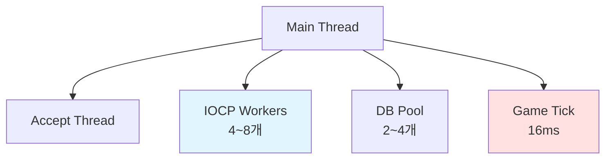
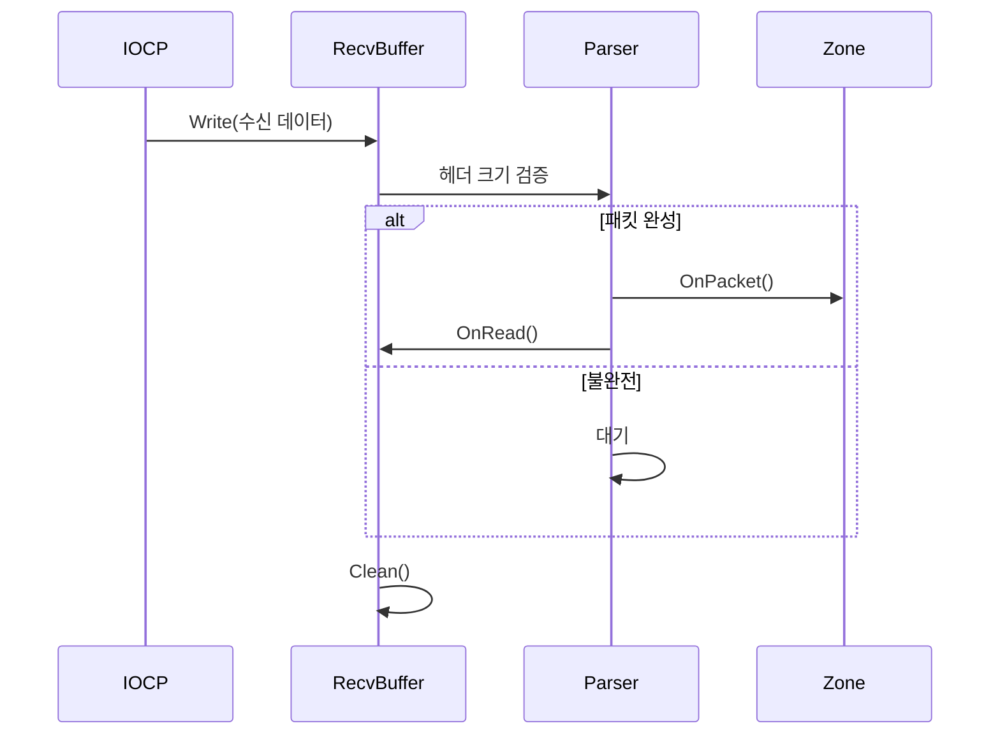
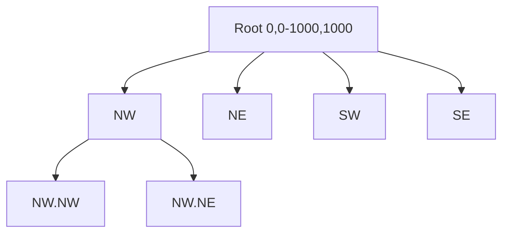

# MMORPG 게임 서버 아키텍처 - Part 1

## 목차
1. [전체 시스템 구성](#1-전체-시스템-구성)
2. [스레드 아키텍처](#2-스레드-아키텍처)
3. [링버퍼 기반 패킷 조립](#3-링버퍼-기반-패킷-조립)
4. [Quadtree 공간 분할](#4-quadtree-공간-분할)
5. [Lock-Free 자료구조](#5-lock-free-자료구조)
- [Q&A](#qa)

---

## 1. 전체 시스템 구성

### Phase 1: 단일 서버 (현재)



**설계 원칙:**
- 단일 프로세스 멀티스레딩 - 복잡도 관리
- Zone별 독립 Lock - 확장 가능 구조
- 완성도 우선 - 분산은 Phase 2

---

## 2. 스레드 아키텍처

### 전체 구성



### 각 역할

| 스레드 | 역할 | 개수 |
|--------|------|------|
| **Main** | 초기화, 콘솔 명령 | 1 |
| **Accept** | 연결 수락 → IOCP 등록 | 1 |
| **IOCP Workers** | 패킷 송수신 → JobQueue Push | 4~8 |
| **Game Tick** | JobQueue Pop → 게임 로직 실행 | 1 |
| **DB Pool** | 비동기 DB 쿼리 | 2~4 |

### 핵심 흐름

```
클라이언트 → IOCP Worker (수신) 
          → JobQueue.Push() [Lock-Free]
          → Game Tick Thread (처리)
          → IOCP Worker (송신)
```

**설계 포인트:**
- Game Tick이 **Single-Writer** → Lock 불필요
- IOCP는 패킷만 받고 즉시 리턴 → 처리 시간 6ms
- 16ms 고정 Tick으로 안정적 동기화

---

## 3. 링버퍼 기반 패킷 조립

### 패킷 단편화 문제

```
TCP는 스트림 → 패킷 경계 없음
[HEADER|BODY][HEAD|ER|BODY][HEADER|BODY]
     ↑              ↑
  완전한 패킷    조각난 패킷
```

### 링버퍼 해결

```cpp
class RingBuffer {
    BYTE _buffer[BUFFER_SIZE];
    int _readPos = 0;
    int _writePos = 0;
    
    // 핵심 연산
    void OnWrite(int len);      // 쓰기 커서 이동
    void OnRead(int len);       // 읽기 커서 이동
    void Clean();               // 공간 확보
};
```

### 조립 과정



**장점:**
- 고정 크기 버퍼 재사용 (malloc/free 없음)
- 캐시 친화적 연속 메모리
- 자동 공간 정리

---

## 4. Quadtree 공간 분할

### 개념



**장점:**
- 범위 검색 O(log n)
- 동적 분할 (밀집도 따라)
- 빈 공간 메모리 절약

### 핵심 알고리즘

```cpp
// 의사 코드
void Insert(obj) {
    if (!범위_내) return;
    
    if (리프노드) {
        objects.add(obj);
        if (개수 > 10 && 깊이 < 5)
            Subdivide();  // 4개 자식 생성
    } else {
        자식노드[인덱스]->Insert(obj);
    }
}

void Query(범위, 결과) {
    if (!범위_겹침) return;
    
    if (리프노드) {
        for (obj : objects)
            if (범위_내) 결과.add(obj);
    } else {
        for (자식 : 4개)
            자식->Query(범위, 결과);
    }
}
```

**성능:**
- 시야 검색 시간: O(n) → O(log n)
- 1000명 중 100명 검색: 1000번 → 40번

---

## 5. Lock-Free 자료구조

### MPSC Queue (Multiple Producer, Single Consumer)

```cpp
// 핵심 개념만
class LockFreeQueue {
    atomic<Node*> _head;
    atomic<Node*> _tail;
    
    void Push(T value) {
        Node* newNode = Alloc();
        newNode->data = value;
        
        // CAS로 tail 업데이트
        while (!_tail.compare_exchange_weak(
            oldTail, newNode, memory_order_release))
            continue;
    }
    
    bool Pop(T& out) {
        // Single Consumer만 호출
        Node* node = _head.load(memory_order_acquire);
        if (!node) return false;
        
        out = node->data;
        _head.store(node->next, memory_order_release);
        Free(node);
        return true;
    }
};
```

**핵심:**
- **CAS (Compare-And-Swap)** - 원자적 업데이트
- **Memory Ordering** - 가시성 보장
- **ABA 문제** - Version Counter로 해결

**성능:**
- Lock 기반: 47,000 ops/s
- Lock-Free: 220,000 ops/s (4.7배)

---

## Q&A

### Q1. "왜 IOCP를 선택했나요?"

**답변:**
"Windows 환경에서 가장 성능이 좋은 비동기 I/O 모델입니다. epoll(Linux)와 달리 커널이 Thread Pool을 관리해주고, Completion 기반이라 Edge-Triggered의 복잡함이 없습니다. 8-Core에서 Worker 8개로 10,000 CCU를 20ms 평균 지연으로 처리했습니다."

### Q2. "Game Tick Thread를 왜 분리했나요?"

**답변:**
"동시성 제어를 단순화하기 위해서입니다. 게임 오브젝트는 Game Tick에서만 수정하므로 Lock이 불필요합니다. IOCP Worker는 Job만 Push하고, Game Tick이 Single-Writer로 순차 실행합니다. 이렇게 하면 데드락이나 Race Condition 걱정이 없습니다."

### Q3. "Quadtree 대신 Grid를 쓰면 안 되나요?"

**답변:**
"Grid는 균등 분포에 유리하지만, 저희 게임은 던전/필드별로 밀집도가 다릅니다. Quadtree는 던전(밀집)에서 깊이 5까지 분할되고, 평원(sparse)에서 깊이 2로 충분합니다. 동적 분할이 더 유연합니다."

### Q4. "Lock-Free가 항상 빠른가요?"

**답변:**
"아닙니다. 경합(contention)이 높을 때만 유리합니다. 8개 IOCP 스레드가 동시에 JobQueue에 Push하므로 Lock 경합이 심했습니다. 하지만 경합이 낮다면 Lock이 더 간단하고 빠를 수 있습니다. 또한 ABA 문제, Memory Ordering 등 구현이 복잡해서 디버깅이 어렵습니다."

### Q5. "서버 권위 모델이 뭔가요?"

**답변:**
"클라이언트를 신뢰하지 않는 원칙입니다. 클라이언트는 '의도'만 전송하고, 모든 검증과 계산은 서버에서 수행합니다. 예를 들어 공격 시 클라이언트는 '몬스터 공격'만 보내고, 서버가 사거리/쿨다운 검증 후 데미지를 계산합니다. 메모리 해킹이나 패킷 변조로 치팅할 수 없습니다."

### Q6. "Dump 분석은 어떻게 하나요?"

**답변:**
"WinDbg를 사용합니다. `!analyze -v`로 크래시 지점 파악, `dv`로 로컬 변수 확인합니다. Access Violation은 nullptr 접근을 빠르게 찾을 수 있고, Deadlock은 `!locks`로 Lock 순서를 분석해 Circular Wait를 발견했습니다."

### Q7. "성능 병목은 어떻게 찾았나요?"

**답변:**
"Visual Studio Profiler의 CPU Usage로 Hot Path를 확인했습니다. RebuildQuadtree가 28%를 차지하는 것을 발견해 Dirty Flag 패턴으로 최적화했고, CPU 사용률을 45%에서 22%로 절반 줄였습니다."

### Q8. "DB 동기화는 어떻게 하나요?"

**답변:**
"Write-Back 캐시 방식입니다. 메모리에 변경사항을 누적하고, 5분마다 또는 로그아웃 시에만 DB에 기록합니다. Dirty Flag로 변경된 필드만 UPDATE하여 쿼리 수를 90% 줄였습니다. 서버 크래시 시 최근 5분 데이터 손실은 허용합니다."

### Q9. "Zone 이동은 어떻게 처리하나요?"

**답변:**
"존 경계를 넘으면:
1. 이전 Zone의 JobQueue에 '제거' Job Push
2. 새 Zone의 JobQueue에 '추가' Job Push
3. Player의 Zone 포인터 변경
4. 주변에 Spawn/Despawn 패킷 전송

추후 분산 환경에서는 Redis로 Zone 간 메시지 전달이나 Player 직렬화가 필요합니다."

### Q10. "세션 관리는 어떻게 하나요?"

**답변:**
"shared_ptr로 세션 생명주기를 관리합니다. IOCP Completion에서 shared_ptr를 보유하고, 연결 종료 시 자동 정리됩니다. weak_ptr로 순환 참조를 방지합니다. OnDisconnected()에서 Zone에서 제거, DB 저장, Despawn 알림, 리소스 정리 순으로 진행합니다."

---

## 참고 자료

### 핵심 문서
- [Microsoft IOCP Docs](https://docs.microsoft.com/en-us/windows/win32/fileio/i-o-completion-ports)
- [Lock-Free Programming](https://preshing.com/20120612/an-introduction-to-lock-free-programming/)
- [Quadtree - Wikipedia](https://en.wikipedia.org/wiki/Quadtree)

### 게임 서버
- [Inflearn - Rookiss 게임 서버](https://www.inflearn.com/course/유니티-mmorpg-개발-part4)
- [Valve GameNetworkingSockets](https://github.com/ValveSoftware/GameNetworkingSockets)

### 디버깅
- [WinDbg Documentation](https://docs.microsoft.com/en-us/windows-hardware/drivers/debugger/)
- [Visual Studio Profiler](https://docs.microsoft.com/en-us/visualstudio/profiling/)

---

**전체 소스 코드:** [GitHub 링크 - 여기에 실제 레포 URL]