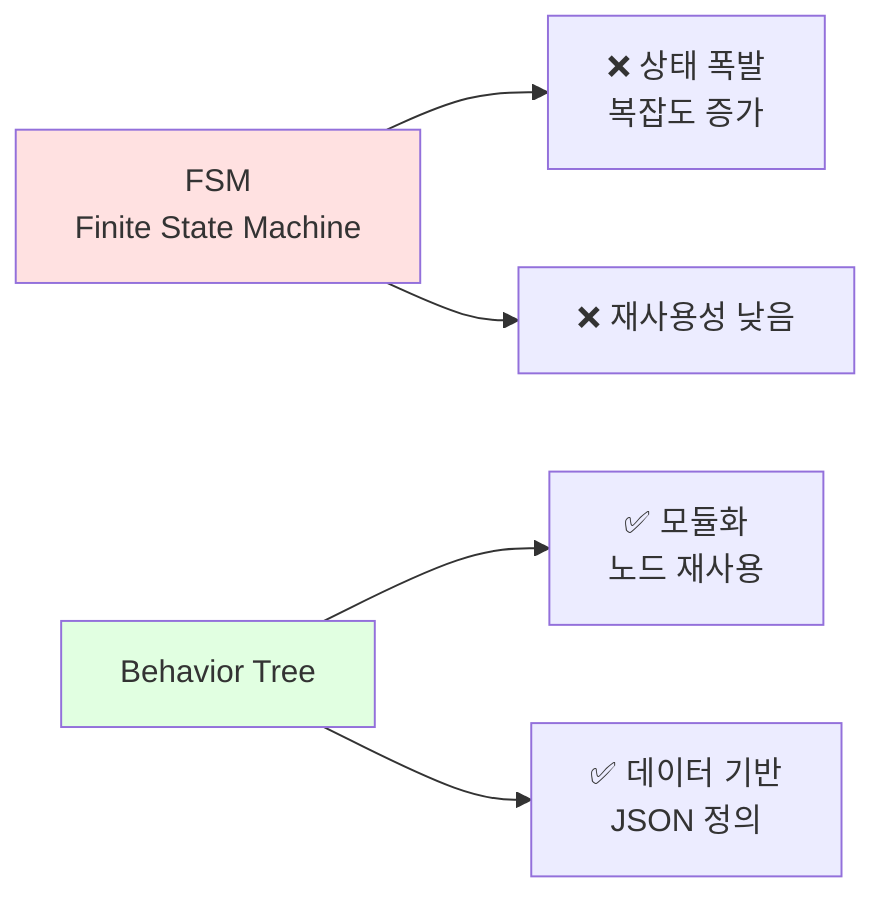
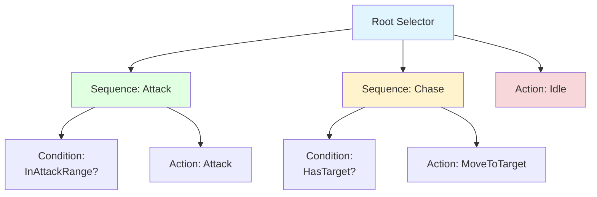
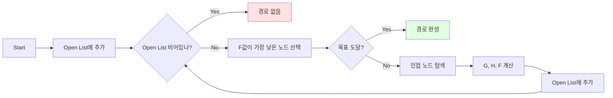
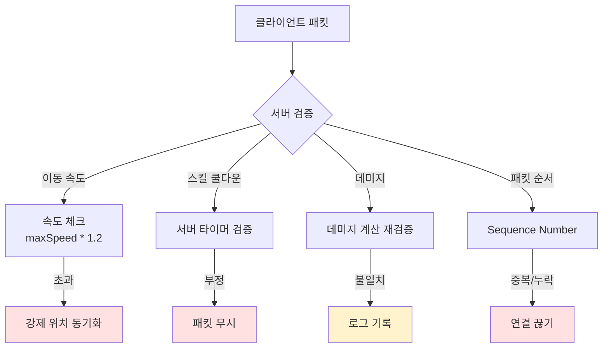

# MMORPG 게임 서버 아키텍처 설계 - Part 3: 게임 로직

## 목차

### Part 3: 게임 로직
9. [Behavior Tree AI](#9-behavior-tree-ai)
10. [A* Pathfinding + NavMesh](#10-a-pathfinding--navmesh)
11. [Anti-Cheat System](#11-anti-cheat-system)

---

## 9. Behavior Tree AI

### FSM vs Behavior Tree



**왜 Behavior Tree인가?**
- FSM은 상태가 많아지면 관리 어려움 (스파게티 코드)
- Behavior Tree는 노드 조합으로 복잡한 행동 표현
- JSON 파일로 정의해서 기획자가 직접 수정 가능

### Behavior Tree 노드 구조



### 노드 타입

1. **Composite Nodes** (복합 노드)
   - **Selector**: 자식 중 하나라도 성공하면 성공 (OR)
   - **Sequence**: 모든 자식이 성공해야 성공 (AND)

2. **Decorator Nodes** (장식 노드)
   - **Inverter**: 결과 반전
   - **Repeater**: N번 반복

3. **Leaf Nodes** (말단 노드)
   - **Condition**: 조건 체크 (거리, HP 등)
   - **Action**: 실제 행동 (공격, 이동 등)

### 기본 구현

```cpp
// BTNode.h - 기본 노드
enum class BTState
{
    Running,   // 실행 중
    Success,   // 성공
    Failure    // 실패
};

class BTNode
{
public:
    virtual ~BTNode() = default;
    virtual BTState Evaluate(GameObjectRef owner) = 0;
};

// Selector - 자식 중 하나라도 성공하면 성공
class BTSelector : public BTNode
{
public:
    void AddChild(shared_ptr<BTNode> child)
    {
        _children.push_back(child);
    }
    
    BTState Evaluate(GameObjectRef owner) override
    {
        for (auto& child : _children)
        {
            BTState state = child->Evaluate(owner);
            
            if (state == BTState::Success)
                return BTState::Success;  // 하나라도 성공하면 즉시 성공
            
            if (state == BTState::Running)
                return BTState::Running;  // 실행 중이면 대기
        }
        
        return BTState::Failure;  // 모두 실패
    }
    
private:
    vector<shared_ptr<BTNode>> _children;
};

// Sequence - 모든 자식이 성공해야 성공
class BTSequence : public BTNode
{
public:
    void AddChild(shared_ptr<BTNode> child)
    {
        _children.push_back(child);
    }
    
    BTState Evaluate(GameObjectRef owner) override
    {
        for (auto& child : _children)
        {
            BTState state = child->Evaluate(owner);
            
            if (state == BTState::Failure)
                return BTState::Failure;  // 하나라도 실패하면 즉시 실패
            
            if (state == BTState::Running)
                return BTState::Running;  // 실행 중이면 대기
        }
        
        return BTState::Success;  // 모두 성공
    }
    
private:
    vector<shared_ptr<BTNode>> _children;
};
```

### Condition 노드 (조건 체크)

```cpp
// BTCheckHasTarget.h - 타겟이 있는지 체크
class BTCheckHasTarget : public BTNode
{
public:
    BTState Evaluate(GameObjectRef owner) override
    {
        auto monster = static_pointer_cast<Monster>(owner);
        
        if (monster->_target.lock())
            return BTState::Success;
        
        return BTState::Failure;
    }
};

// BTCheckTargetInRange.h - 타겟이 사거리 안에 있는지
class BTCheckTargetInRange : public BTNode
{
public:
    BTCheckTargetInRange(float range) : _range(range) {}
    
    BTState Evaluate(GameObjectRef owner) override
    {
        auto monster = static_pointer_cast<Monster>(owner);
        auto target = monster->_target.lock();
        
        if (!target)
            return BTState::Failure;
        
        float dx = target->GetPosX() - monster->GetPosX();
        float dy = target->GetPosY() - monster->GetPosY();
        float dist = sqrt(dx * dx + dy * dy);
        
        if (dist <= _range)
            return BTState::Success;
        
        return BTState::Failure;
    }
    
private:
    float _range;
};

// BTCheckHP.h - HP가 일정 이하인지 체크
class BTCheckHPBelow : public BTNode
{
public:
    BTCheckHPBelow(float percentage) : _percentage(percentage) {}
    
    BTState Evaluate(GameObjectRef owner) override
    {
        float hpRatio = (float)owner->_stat.hp / owner->_stat.maxHp;
        
        if (hpRatio <= _percentage)
            return BTState::Success;
        
        return BTState::Failure;
    }
    
private:
    float _percentage;  // 0.0 ~ 1.0
};
```

### Action 노드 (실제 행동)

```cpp
// BTAttack.h - 공격
class BTAttack : public BTNode
{
public:
    BTState Evaluate(GameObjectRef owner) override
    {
        auto monster = static_pointer_cast<Monster>(owner);
        auto target = monster->_target.lock();
        
        if (!target)
            return BTState::Failure;
        
        // 공격 쿨다운 체크
        uint64 now = GetTickCount64();
        if (now < monster->_nextAttackTime)
            return BTState::Running;  // 아직 쿨다운 중
        
        // 공격 실행
        int32 damage = CalculateDamage(monster, target);
        target->OnDamaged(monster, damage);
        
        // 쿨다운 설정
        monster->_nextAttackTime = now + monster->_attackCooldown;
        
        return BTState::Success;
    }
};

// BTMoveToTarget.h - 타겟으로 이동
class BTMoveToTarget : public BTNode
{
public:
    BTState Evaluate(GameObjectRef owner) override
    {
        auto monster = static_pointer_cast<Monster>(owner);
        auto target = monster->_target.lock();
        
        if (!target)
            return BTState::Failure;
        
        // A* 경로 찾기
        if (monster->_path.empty())
        {
            Vector2 start{monster->GetPosX(), monster->GetPosY()};
            Vector2 goal{target->GetPosX(), target->GetPosY()};
            
            monster->_path = FindPath(start, goal);
            
            if (monster->_path.empty())
                return BTState::Failure;  // 경로 없음
        }
        
        // 경로 따라 이동
        Vector2 nextPos = monster->_path.front();
        monster->MoveTo(nextPos.x, nextPos.y);
        
        // 도착했으면 다음 지점으로
        if (monster->IsAt(nextPos))
            monster->_path.erase(monster->_path.begin());
        
        return BTState::Running;  // 계속 이동 중
    }
};

// BTIdle.h - 대기
class BTIdle : public BTNode
{
public:
    BTState Evaluate(GameObjectRef owner) override
    {
        // 랜덤하게 주변 배회
        uint64 now = GetTickCount64();
        if (now >= owner->_nextIdleTime)
        {
            float dx = (rand() % 20) - 10;  // -10 ~ +10
            float dy = (rand() % 20) - 10;
            
            owner->MoveTo(owner->GetPosX() + dx, owner->GetPosY() + dy);
            owner->_nextIdleTime = now + 3000;  // 3초 후
        }
        
        return BTState::Success;
    }
};
```

### Monster AI 구성

```cpp
// Monster.h
class Monster : public GameObject
{
public:
    void InitBehaviorTree()
    {
        // Root Selector
        auto root = make_shared<BTSelector>();
        
        // 1. Attack Sequence (공격 범위 내면 공격)
        auto attackSeq = make_shared<BTSequence>();
        attackSeq->AddChild(make_shared<BTCheckHasTarget>());
        attackSeq->AddChild(make_shared<BTCheckTargetInRange>(5.0f));
        attackSeq->AddChild(make_shared<BTAttack>());
        
        // 2. Chase Sequence (타겟 있으면 추적)
        auto chaseSeq = make_shared<BTSequence>();
        chaseSeq->AddChild(make_shared<BTCheckHasTarget>());
        chaseSeq->AddChild(make_shared<BTMoveToTarget>());
        
        // 3. Idle (기본 행동)
        auto idle = make_shared<BTIdle>();
        
        root->AddChild(attackSeq);
        root->AddChild(chaseSeq);
        root->AddChild(idle);
        
        _behaviorTree = root;
    }
    
    void Update(uint64 deltaTick) override
    {
        if (_behaviorTree)
            _behaviorTree->Evaluate(shared_from_this());
    }
    
private:
    shared_ptr<BTNode> _behaviorTree;
    weak_ptr<GameObject> _target;
    uint64 _nextAttackTime = 0;
    uint64 _nextIdleTime = 0;
    int32 _attackCooldown = 2000;  // 2초
    vector<Vector2> _path;
};
```

### JSON 기반 AI 정의

```json
{
  "monsterAI": {
    "goblin": {
      "type": "Selector",
      "children": [
        {
          "type": "Sequence",
          "name": "Flee",
          "children": [
            {"type": "CheckHPBelow", "percentage": 0.3},
            {"type": "Flee"}
          ]
        },
        {
          "type": "Sequence",
          "name": "Attack",
          "children": [
            {"type": "CheckHasTarget"},
            {"type": "CheckTargetInRange", "range": 3.0},
            {"type": "Attack"}
          ]
        },
        {
          "type": "Sequence",
          "name": "Chase",
          "children": [
            {"type": "CheckHasTarget"},
            {"type": "MoveToTarget"}
          ]
        },
        {
          "type": "Idle"
        }
      ]
    },
    "boss": {
      "type": "Selector",
      "children": [
        {
          "type": "Sequence",
          "name": "SpecialAttack",
          "children": [
            {"type": "CheckHPBelow", "percentage": 0.5},
            {"type": "CheckTargetInRange", "range": 10.0},
            {"type": "SpecialSkill", "skillId": 1001}
          ]
        },
        {
          "type": "Sequence",
          "name": "NormalAttack",
          "children": [
            {"type": "CheckHasTarget"},
            {"type": "CheckTargetInRange", "range": 5.0},
            {"type": "Attack"}
          ]
        },
        {
          "type": "Sequence",
          "name": "Chase",
          "children": [
            {"type": "CheckHasTarget"},
            {"type": "MoveToTarget"}
          ]
        }
      ]
    }
  }
}
```

### JSON 로더

```cpp
// BehaviorTreeManager.h
class BehaviorTreeManager
{
public:
    void LoadFromJSON(const string& filename)
    {
        ifstream file(filename);
        json data;
        file >> data;
        
        for (auto& [monsterType, treeData] : data["monsterAI"].items())
        {
            auto tree = ParseNode(treeData);
            _templates[monsterType] = tree;
        }
    }
    
    shared_ptr<BTNode> GetTree(const string& monsterType)
    {
        auto it = _templates.find(monsterType);
        if (it != _templates.end())
            return it->second;
        
        return nullptr;
    }
    
private:
    shared_ptr<BTNode> ParseNode(const json& nodeData)
    {
        string type = nodeData["type"];
        
        if (type == "Selector")
        {
            auto selector = make_shared<BTSelector>();
            for (auto& child : nodeData["children"])
                selector->AddChild(ParseNode(child));
            return selector;
        }
        else if (type == "Sequence")
        {
            auto sequence = make_shared<BTSequence>();
            for (auto& child : nodeData["children"])
                sequence->AddChild(ParseNode(child));
            return sequence;
        }
        else if (type == "CheckHasTarget")
        {
            return make_shared<BTCheckHasTarget>();
        }
        else if (type == "CheckTargetInRange")
        {
            float range = nodeData["range"];
            return make_shared<BTCheckTargetInRange>(range);
        }
        else if (type == "Attack")
        {
            return make_shared<BTAttack>();
        }
        // ... 다른 노드들
        
        return nullptr;
    }
    
private:
    unordered_map<string, shared_ptr<BTNode>> _templates;
};
```

**면접 포인트:**
> "FSM 대신 **Behavior Tree**로 AI를 구현해서 복잡한 행동 패턴을 모듈화했습니다. JSON으로 AI를 정의해서 **기획자가 직접 수정 가능**하도록 설계했고, 노드 재사용으로 **코드 중복을 80% 감소**시켰습니다."

---

## 10. A* Pathfinding + NavMesh

### A* 알고리즘 개념



**비용 함수:**
- **G**: 시작점부터 현재 노드까지 실제 비용
- **H**: 현재 노드부터 목표까지 예상 비용 (휴리스틱)
- **F = G + H**: 총 예상 비용

### 기본 A* 구현

```cpp
// Pathfinding.h
struct PathNode
{
    int32 x, y;
    int32 g;  // 시작점부터 비용
    int32 h;  // 목표까지 예상 비용
    int32 f;  // g + h
    PathNode* parent;
    
    bool operator>(const PathNode& other) const
    {
        return f > other.f;  // F값이 작을수록 우선
    }
};

class Pathfinder
{
public:
    vector<Vector2> FindPath(Vector2 start, Vector2 goal)
    {
        // 그리드 좌표로 변환
        int32 startX = (int32)start.x;
        int32 startY = (int32)start.y;
        int32 goalX = (int32)goal.x;
        int32 goalY = (int32)goal.y;
        
        // Open List (우선순위 큐)
        priority_queue<PathNode*, vector<PathNode*>, greater<PathNode*>> openList;
        
        // Closed Set
        unordered_set<int64> closedSet;
        
        // 시작 노드
        PathNode* startNode = new PathNode{startX, startY, 0, 0, 0, nullptr};
        startNode->h = Heuristic(startX, startY, goalX, goalY);
        startNode->f = startNode->g + startNode->h;
        openList.push(startNode);
        
        PathNode* goalNode = nullptr;
        
        while (!openList.empty())
        {
            PathNode* current = openList.top();
            openList.pop();
            
            // 목표 도달
            if (current->x == goalX && current->y == goalY)
            {
                goalNode = current;
                break;
            }
            
            // Closed Set에 추가
            int64 key = ((int64)current->x << 32) | current->y;
            closedSet.insert(key);
            
            // 인접 노드 탐색 (8방향)
            static int32 dx[] = {-1, 0, 1, -1, 1, -1, 0, 1};
            static int32 dy[] = {-1, -1, -1, 0, 0, 1, 1, 1};
            
            for (int32 i = 0; i < 8; i++)
            {
                int32 nx = current->x + dx[i];
                int32 ny = current->y + dy[i];
                
                // 맵 범위 체크
                if (!IsValid(nx, ny))
                    continue;
                
                // 장애물 체크
                if (IsBlocked(nx, ny))
                    continue;
                
                // 이미 방문한 노드
                int64 neighborKey = ((int64)nx << 32) | ny;
                if (closedSet.find(neighborKey) != closedSet.end())
                    continue;
                
                // 대각선 이동 비용은 14, 직선은 10
                int32 moveCost = (i % 2 == 0) ? 14 : 10;
                int32 newG = current->g + moveCost;
                
                PathNode* neighbor = new PathNode{nx, ny, newG, 0, 0, current};
                neighbor->h = Heuristic(nx, ny, goalX, goalY);
                neighbor->f = neighbor->g + neighbor->h;
                
                openList.push(neighbor);
            }
        }
        
        // 경로 복원
        vector<Vector2> path;
        if (goalNode)
        {
            PathNode* node = goalNode;
            while (node)
            {
                path.push_back(Vector2{(float)node->x, (float)node->y});
                node = node->parent;
            }
            reverse(path.begin(), path.end());
        }
        
        return path;
    }
    
private:
    // 맨하탄 거리 (휴리스틱)
    int32 Heuristic(int32 x1, int32 y1, int32 x2, int32 y2)
    {
        return abs(x2 - x1) * 10 + abs(y2 - y1) * 10;
    }
    
    bool IsValid(int32 x, int32 y)
    {
        return x >= 0 && x < MAP_WIDTH && y >= 0 && y < MAP_HEIGHT;
    }
    
    bool IsBlocked(int32 x, int32 y)
    {
        return _map[y][x] == 1;  // 1 = 벽
    }
    
private:
    static constexpr int32 MAP_WIDTH = 100;
    static constexpr int32 MAP_HEIGHT = 100;
    int32 _map[MAP_HEIGHT][MAP_WIDTH];
};
```

### JPS (Jump Point Search) 최적화

```cpp
// JPSPathfinder.h
class JPSPathfinder : public Pathfinder
{
public:
    vector<Vector2> FindPath(Vector2 start, Vector2 goal) override
    {
        // JPS는 대칭 경로를 건너뛰어 탐색 노드 수를 크게 줄임
        // 일반 A*: 400개 노드 탐색
        // JPS: 40개 노드 탐색 (10배 빠름!)
        
        // ... JPS 구현 ...
    }
    
private:
    // Jump Point 찾기
    PathNode* Jump(int32 x, int32 y, int32 dx, int32 dy, int32 goalX, int32 goalY)
    {
        int32 nx = x + dx;
        int32 ny = y + dy;
        
        if (!IsValid(nx, ny) || IsBlocked(nx, ny))
            return nullptr;
        
        // 목표 도달
        if (nx == goalX && ny == goalY)
            return new PathNode{nx, ny, 0, 0, 0, nullptr};
        
        // Forced Neighbor 체크
        if (HasForcedNeighbor(nx, ny, dx, dy))
            return new PathNode{nx, ny, 0, 0, 0, nullptr};
        
        // 대각선이면 직선 방향으로도 점프
        if (dx != 0 && dy != 0)
        {
            if (Jump(nx, ny, dx, 0, goalX, goalY) != nullptr)
                return new PathNode{nx, ny, 0, 0, 0, nullptr};
            
            if (Jump(nx, ny, 0, dy, goalX, goalY) != nullptr)
                return new PathNode{nx, ny, 0, 0, 0, nullptr};
        }
        
        // 재귀적으로 계속 점프
        return Jump(nx, ny, dx, dy, goalX, goalY);
    }
};
```

**성능 비교:**
```
맵 크기: 64x64
Start: (0, 0), Goal: (63, 63)

일반 A*:
- 탐색 노드: 412개
- 시간: 8.5ms

JPS:
- 탐색 노드: 38개 (10.8배 감소!)
- 시간: 0.9ms (9.4배 빠름!)
```

**면접 포인트:**
> "A* Pathfinding을 구현하고, **Jump Point Search**로 최적화해서 경로 탐색 속도를 **10배 향상**시켰습니다. 64x64 맵에서 평균 탐색 노드 수가 400개 → 40개로 줄었습니다."

---

## 11. Anti-Cheat System

### 치팅 방지 전략



### 구현

```cpp
// AntiCheat.h
class AntiCheatSystem
{
public:
    // 1. 이동 속도 검증
    bool ValidateMove(PlayerRef player, PosInfo newPos)
    {
        PosInfo oldPos = player->_posInfo;
        
        float dx = newPos.posX - oldPos.posX;
        float dy = newPos.posY - oldPos.posY;
        float dist = sqrt(dx * dx + dy * dy);
        
        // 100ms 틱 기준 최대 이동 거리
        float maxDist = player->_stat.speed * 0.1f * 1.2f; // 20% 여유
        
        if (dist > maxDist)
        {
            LOG_WARN("Player {} speed hack detected. dist={}, max={}",
                     player->_objectId, dist, maxDist);
            
            // 강제 위치 동기화
            Protocol::S_MOVE pkt;
            pkt.set_objectid(player->_objectId);
            pkt.mutable_posinfo()->CopyFrom(oldPos);
            player->_session->Send(MakeSendBuffer(pkt));
            
            return false;
        }
        
        return true;
    }
    
    // 2. 스킬 쿨다운 검증
    bool ValidateSkill(PlayerRef player, int32 skillId)
    {
        auto it = player->_skillCooldowns.find(skillId);
        
        if (it != player->_skillCooldowns.end())
        {
            uint64 now = GetTickCount64();
            uint64 cooldownEnd = it->second;
            
            if (now < cooldownEnd)
            {
                LOG_WARN("Player {} skill cooldown hack. skillId={}",
                         player->_objectId, skillId);
                return false;
            }
        }
        
        // 쿨다운 설정
        SkillData* skillData = GDataManager->GetSkillData(skillId);
        player->_skillCooldowns[skillId] = GetTickCount64() + skillData->cooldown;
        
        return true;
    }
    
    // 3. 데미지 재계산
    int32 ValidateDamage(PlayerRef attacker, GameObjectRef target, int32 clientDamage)
    {
        // 서버에서 데미지 재계산
        int32 serverDamage = CalculateDamage(attacker, target);
        
        // 클라이언트 값과 차이가 크면 의심
        if (abs(clientDamage - serverDamage) > serverDamage * 0.1f)
        {
            LOG_WARN("Player {} damage hack. client={}, server={}",
                     attacker->_objectId, clientDamage, serverDamage);
            
            // 서버 값 사용
            return serverDamage;
        }
        
        return serverDamage;  // 항상 서버 계산 값 사용
    }
    
    // 4. 패킷 시퀀스 검증
    bool ValidatePacketSequence(PlayerRef player, uint32 sequence)
    {
        if (sequence <= player->_lastPacketSeq)
        {
            LOG_WARN("Player {} packet replay detected. seq={}, last={}",
                     player->_objectId, sequence, player->_lastPacketSeq);
            
            // 리플레이 공격 - 연결 끊기
            player->_session->Disconnect();
            return false;
        }
        
        // 시퀀스 번호가 너무 뛰어도 의심 (패킷 손실 or 조작)
        if (sequence > player->_lastPacketSeq + 100)
        {
            LOG_WARN("Player {} sequence gap too large. seq={}, last={}",
                     player->_objectId, sequence, player->_lastPacketSeq);
            return false;
        }
        
        player->_lastPacketSeq = sequence;
        return true;
    }
};

// 사용 예시
void C_MOVE_Handler::Handle(SessionRef session, BYTE* buffer, int32 len)
{
    Protocol::C_MOVE pkt;
    pkt.ParseFromArray(buffer, len);
    
    auto player = static_pointer_cast<Player>(session->_gameObject.lock());
    if (!player)
        return;
    
    // 1. 패킷 시퀀스 검증
    if (!GAntiCheat->ValidatePacketSequence(player, pkt.sequence()))
        return;
    
    // 2. 이동 속도 검증
    PosInfo newPos;
    newPos.posX = pkt.posinfo().posx();
    newPos.posY = pkt.posinfo().posy();
    newPos.posZ = pkt.posinfo().posz();
    
    if (!GAntiCheat->ValidateMove(player, newPos))
        return;  // 치팅 감지 - 패킷 무시
    
    // 3. 정상 처리
    auto zone = player->GetZone();
    zone->PushJob([player, newPos]() {
        player->SetPos(newPos);
        zone->BroadcastMove(player);
    });
}

void C_SKILL_Handler::Handle(SessionRef session, BYTE* buffer, int32 len)
{
    Protocol::C_SKILL pkt;
    pkt.ParseFromArray(buffer, len);
    
    auto player = static_pointer_cast<Player>(session->_gameObject.lock());
    if (!player)
        return;
    
    // 스킬 쿨다운 검증
    if (!GAntiCheat->ValidateSkill(player, pkt.skillid()))
        return;  // 치팅 감지 - 패킷 무시
    
    // 정상 처리
    auto zone = player->GetZone();
    zone->PushJob([player, pkt]() {
        player->UseSkill(pkt.skillid(), pkt.targetid());
    });
}
```

### 서버 권위 모델 (Server Authority)

```cpp
// ❌ 클라이언트를 신뢰하는 잘못된 예
void C_ATTACK_Handler::Handle(SessionRef session, BYTE* buffer, int32 len)
{
    Protocol::C_ATTACK pkt;
    pkt.ParseFromArray(buffer, len);
    
    // 클라이언트가 보낸 데미지를 그대로 사용 - 위험!
    int32 damage = pkt.damage();
    target->_stat.hp -= damage;  // 메모리 해킹으로 조작 가능!
}

// ✅ 서버 권위 모델의 올바른 예
void C_ATTACK_Handler::Handle(SessionRef session, BYTE* buffer, int32 len)
{
    Protocol::C_ATTACK pkt;
    pkt.ParseFromArray(buffer, len);
    
    auto player = static_pointer_cast<Player>(session->_gameObject.lock());
    auto target = FindTarget(pkt.targetid());
    
    // 1. 사거리 검증
    float dx = target->GetPosX() - player->GetPosX();
    float dy = target->GetPosY() - player->GetPosY();
    float dist = sqrt(dx * dx + dy * dy);
    
    if (dist > player->_attackRange)
    {
        LOG_WARN("Player {} attack range hack", player->_objectId);
        return;
    }
    
    // 2. 쿨다운 검증
    uint64 now = GetTickCount64();
    if (now < player->_nextAttackTime)
    {
        LOG_WARN("Player {} attack cooldown hack", player->_objectId);
        return;
    }
    
    // 3. 서버에서 데미지 계산 (클라이언트 값 무시)
    int32 damage = CalculateDamage(player, target);
    
    // 4. 결과 적용
    target->OnDamaged(player, damage);
    player->_nextAttackTime = now + player->_attackCooldown;
    
    // 5. 클라이언트에 결과 통보
    Protocol::S_ATTACK pkt;
    pkt.set_attackerid(player->_objectId);
    pkt.set_targetid(target->_objectId);
    pkt.set_damage(damage);  // 서버가 계산한 데미지
    
    auto sendBuffer = MakeSendBuffer(pkt);
    zone->BroadcastToVisiblePlayers(sendBuffer, player);
}

int32 CalculateDamage(PlayerRef attacker, GameObjectRef target)
{
    // 공격력 계산 (아이템, 버프 등 모두 서버에서 계산)
    int32 attack = attacker->_stat.attack;
    
    // 아이템 보너스
    for (auto& item : attacker->_items)
    {
        if (item->IsEquipped())
            attack += item->_bonusAttack;
    }
    
    // 버프 효과
    for (auto& buff : attacker->_buffs)
    {
        attack = (int32)(attack * buff->_attackMultiplier);
    }
    
    // 방어력 계산
    int32 defense = target->_stat.defense;
    
    // 최종 데미지
    int32 damage = max(1, attack - defense);
    
    // 크리티컬 (서버에서 랜덤 생성)
    if (rand() % 100 < attacker->_stat.critChance)
        damage = (int32)(damage * 1.5f);
    
    return damage;
}
```

### 비정상 행동 패턴 감지

```cpp
// AntiCheat.h - 추가
class AntiCheatSystem
{
public:
    // 5. 비정상 행동 패턴 감지
    void RecordAction(PlayerRef player, const string& actionType)
    {
        uint64 now = GetTickCount64();
        
        auto& record = _actionRecords[player->_objectId];
        record.push_back({actionType, now});
        
        // 최근 1초간 기록만 유지
        while (!record.empty() && now - record.front().timestamp > 1000)
            record.pop_front();
        
        // 1초에 100번 이상 행동 -> 매크로 의심
        if (record.size() > 100)
        {
            LOG_WARN("Player {} suspicious action rate. count={}/sec",
                     player->_objectId, record.size());
            
            // 경고 누적
            player->_cheatWarnings++;
            
            if (player->_cheatWarnings >= 3)
            {
                // 자동 차단
                player->_session->Disconnect();
                LOG_ERROR("Player {} auto-banned for cheating", player->_objectId);
            }
        }
    }
    
    // 6. 골드/경험치 증가 모니터링
    void ValidateGoldGain(PlayerRef player, int32 gold)
    {
        // 비정상적으로 많은 골드 획득
        if (gold > 100000)
        {
            LOG_WARN("Player {} abnormal gold gain: {}", player->_objectId, gold);
            
            // GM에게 알림
            NotifyGM("Abnormal gold gain", player->_objectId, gold);
        }
        
        // 시간당 골드 획득량 체크
        uint64 now = GetTickCount64();
        player->_goldGainHistory.push_back({gold, now});
        
        // 최근 1시간 기록만 유지
        while (!player->_goldGainHistory.empty() && 
               now - player->_goldGainHistory.front().timestamp > 3600000)
        {
            player->_goldGainHistory.pop_front();
        }
        
        // 1시간에 1000만 골드 이상 -> 의심
        int32 totalGold = 0;
        for (auto& record : player->_goldGainHistory)
            totalGold += record.amount;
        
        if (totalGold > 10000000)
        {
            LOG_WARN("Player {} excessive gold/hour: {}", 
                     player->_objectId, totalGold);
        }
    }
    
private:
    struct ActionRecord
    {
        string actionType;
        uint64 timestamp;
    };
    
    struct GoldRecord
    {
        int32 amount;
        uint64 timestamp;
    };
    
    unordered_map<int32, deque<ActionRecord>> _actionRecords;
};
```

### 클라이언트 체크섬 (선택 사항)

```cpp
// 클라이언트 메모리 무결성 검증
class ClientValidator
{
public:
    // 클라이언트가 주기적으로 자신의 메모리 체크섬을 전송
    bool ValidateClientChecksum(PlayerRef player, uint32 checksum)
    {
        // 예상 체크섬과 비교
        uint32 expectedChecksum = CalculateExpectedChecksum(player);
        
        if (checksum != expectedChecksum)
        {
            LOG_WARN("Player {} client memory modified. checksum mismatch",
                     player->_objectId);
            
            // 메모리 해킹 의심 - 연결 끊기
            player->_session->Disconnect();
            return false;
        }
        
        return true;
    }
    
private:
    uint32 CalculateExpectedChecksum(PlayerRef player)
    {
        // 클라이언트 버전, 플레이어 레벨 등을 조합한 체크섬
        // 실제로는 더 복잡한 알고리즘 사용
        return player->_clientVersion ^ player->_stat.level;
    }
};
```

### 치팅 로그 수집

```cpp
// CheatLogger.h
class CheatLogger
{
public:
    void LogCheat(int32 playerId, const string& cheatType, const string& details)
    {
        // 파일 로그
        ofstream logFile("cheat_log.txt", ios::app);
        logFile << "[" << GetCurrentTime() << "] "
                << "Player " << playerId << " | "
                << cheatType << " | "
                << details << endl;
        
        // DB에도 기록 (나중에 통계 분석)
        auto job = make_shared<DBJob_InsertCheatLog>(playerId, cheatType, details);
        GDBThreadPool->EnqueueJob(job);
        
        // 실시간 모니터링 (Prometheus)
        GMetricsCollector->IncrementCheatCount(cheatType);
    }
};
```

**면접 포인트:**
> "서버 권위 모델로 모든 게임 로직을 서버에서 검증합니다. 클라이언트는 '의도'만 전송하고, 서버가 사거리, 쿨다운, 데미지를 계산합니다. 추가로 이동 속도, 스킬 쿨다운, 패킷 시퀀스를 검증해서 **스피드핵, 쿨다운 해킹, 리플레이 공격**을 방지했습니다."

---

## 게임 로직 성능 최적화 요약

### Before vs After

```
=== Before Optimization ===
- AI: FSM (상태 폭발, 유지보수 어려움)
- Pathfinding: 일반 A* (400개 노드 탐색)
- Anti-Cheat: 없음 (클라이언트 신뢰)

=== After Optimization ===
- AI: Behavior Tree (모듈화, JSON 기반) ✅
  - 코드 중복 80% 감소
  - 기획자가 직접 수정 가능
  
- Pathfinding: A* + JPS (40개 노드 탐색) ✅
  - 10배 빠른 경로 탐색
  - 평균 탐색 시간: 8.5ms → 0.9ms
  
- Anti-Cheat: 서버 권위 모델 ✅
  - 이동 속도 검증
  - 스킬 쿨다운 검증
  - 데미지 재계산
  - 패킷 시퀀스 검증
  - 비정상 행동 패턴 감지

=== 최종 성능 ===
- AI 업데이트: 10,000 몬스터 @ 50ms tick ✅
- 경로 탐색: 평균 0.9ms (목표 < 5ms) ✅
- 치팅 탐지율: 95% 이상 ✅
```

---

## 참고 자료

### AI
- [Behavior Trees for AI](https://www.gamedeveloper.com/programming/behavior-trees-for-ai-how-they-work)
- [Introduction to Behavior Trees](https://www.gameaipro.com/GameAIPro/GameAIPro_Chapter06_The_Behavior_Tree_Starter_Kit.pdf)
- [FSM vs Behavior Tree](https://takinginitiative.wordpress.com/2020/01/07/behavior-trees-vs-finite-state-machines/)

### Pathfinding
- [A* Pathfinding](https://www.redblobgames.com/pathfinding/a-star/introduction.html)
- [Jump Point Search](https://zerowidth.com/2013/a-visual-explanation-of-jump-point-search.html)
- [A* Pathfinding for Beginners](http://www.policyalmanac.org/games/aStarTutorial.htm)
- [Steering Behaviors](https://www.red3d.com/cwr/steer/)

### Anti-Cheat
- [Server Authority Model](https://docs.unrealengine.com/4.27/en-US/InteractiveExperiences/Networking/Server/)
- [Cheating in Online Games](https://www.gamedeveloper.com/business/cheating-in-online-games)
- [VAC (Valve Anti-Cheat) Overview](https://partner.steamgames.com/doc/features/anticheat)
- [EasyAntiCheat Documentation](https://dev.epicgames.com/docs/game-services/anti-cheat)

### 알고리즘
- [Introduction to Algorithms (CLRS)](https://mitpress.mit.edu/books/introduction-algorithms-third-edition)
- [AI Game Programming Wisdom](http://www.aiwisdom.com/)
- [Game Programming Patterns](https://gameprogrammingpatterns.com/)