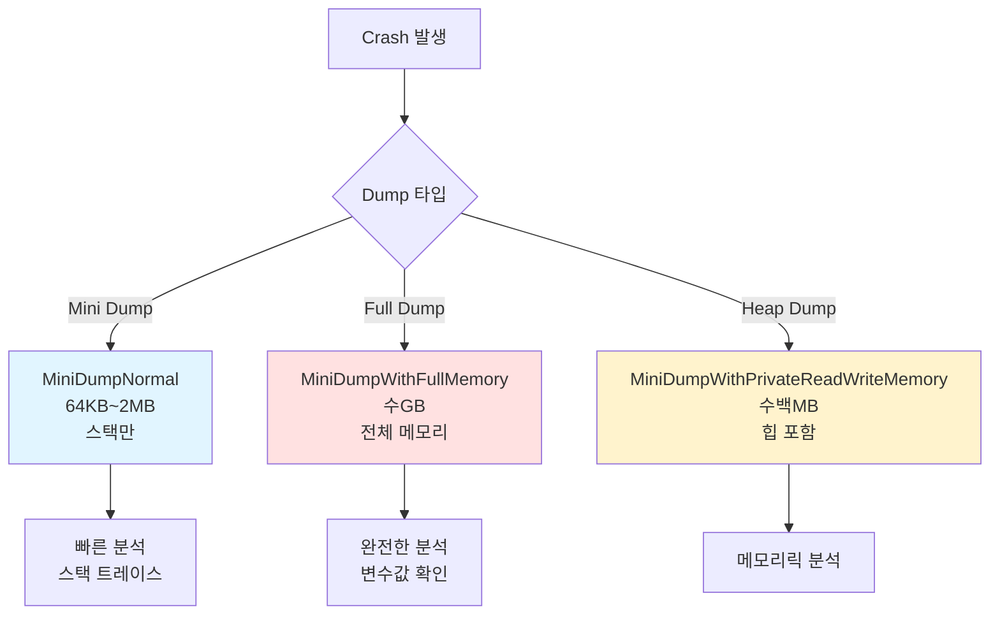
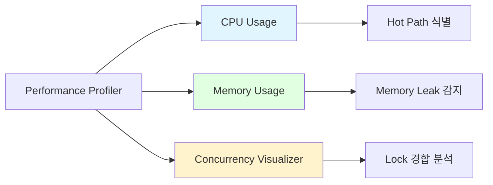

# MMORPG 게임 서버 아키텍처 설계 - Part 6: 디버깅 및 프로파일링

## 목차

### Part 6: 디버깅 및 프로파일링
18. [Dump 분석 및 디버깅 전략 (Windows)](#18-dump-분석-및-디버깅-전략-windows)
19. [성능 프로파일링 (Visual Studio + ETW)](#19-성능-프로파일링-visual-studio--etw)
20. [실전 트러블슈팅 사례](#20-실전-트러블슈팅-사례)
21. [크래시 로깅 시스템](#21-크래시-로깅-시스템)

---

## 18. Dump 분석 및 디버깅 전략 (Windows)

### Dump 파일 종류



**Dump 타입 선택 가이드:**
- **개발 중**: Full Dump (모든 정보 필요)
- **테스트**: Heap Dump (메모리 문제 분석)
- **운영**: Mini Dump (파일 크기 작음, 빠른 업로드)

### MiniDump 자동 생성

```cpp
// CrashHandler.h
#pragma once
#include <windows.h>
#include <DbgHelp.h>
#pragma comment(lib, "dbghelp.lib")

class CrashHandler
{
public:
    static void Initialize()
    {
        // Unhandled Exception Handler 등록
        _prevFilter = ::SetUnhandledExceptionFilter(ExceptionFilter);
        
        // Invalid Parameter Handler
        _set_invalid_parameter_handler(InvalidParameterHandler);
        
        // Pure Virtual Call Handler
        _set_purecall_handler(PurecallHandler);
        
        LOG_INFO("Crash handler initialized");
    }
    
private:
    static LONG WINAPI ExceptionFilter(EXCEPTION_POINTERS* exceptionInfo)
    {
        // 1. Dump 파일 생성
        wstring dumpPath = CreateDumpFile(exceptionInfo);
        
        // 2. 상세 로그 기록
        LogCrashInfo(exceptionInfo, dumpPath);
        
        // 3. 서버에 알림 (선택사항)
        NotifyCrashToServer(dumpPath);
        
        // 4. 프로세스 종료
        return EXCEPTION_EXECUTE_HANDLER;
    }
    
    static wstring CreateDumpFile(EXCEPTION_POINTERS* exceptionInfo)
    {
        // 타임스탬프로 파일명 생성
        SYSTEMTIME st;
        ::GetLocalTime(&st);
        
        wchar_t dumpPath[MAX_PATH];
        ::swprintf_s(dumpPath, L"Dumps/Crash_%04d%02d%02d_%02d%02d%02d.dmp",
            st.wYear, st.wMonth, st.wDay,
            st.wHour, st.wMinute, st.wSecond);
        
        HANDLE hFile = ::CreateFileW(
            dumpPath,
            GENERIC_WRITE,
            0,
            NULL,
            CREATE_ALWAYS,
            FILE_ATTRIBUTE_NORMAL,
            NULL
        );
        
        if (hFile == INVALID_HANDLE_VALUE)
        {
            LOG_ERROR("Failed to create dump file");
            return L"";
        }
        
        // Dump 타입 설정
        MINIDUMP_EXCEPTION_INFORMATION exceptionParam;
        exceptionParam.ThreadId = ::GetCurrentThreadId();
        exceptionParam.ExceptionPointers = exceptionInfo;
        exceptionParam.ClientPointers = FALSE;
        
        // 운영 환경: Mini Dump (작은 파일 크기)
        // 개발 환경: Heap Dump (메모리 정보 포함)
        MINIDUMP_TYPE dumpType = (MINIDUMP_TYPE)(
            MiniDumpWithPrivateReadWriteMemory |  // 힙 메모리
            MiniDumpWithDataSegs |                 // 전역 변수
            MiniDumpWithHandleData |               // 핸들 정보
            MiniDumpWithFullMemoryInfo |           // 메모리 레이아웃
            MiniDumpWithThreadInfo |               // 스레드 정보
            MiniDumpWithUnloadedModules            // 언로드된 DLL
        );
        
        BOOL success = ::MiniDumpWriteDump(
            ::GetCurrentProcess(),
            ::GetCurrentProcessId(),
            hFile,
            dumpType,
            &exceptionParam,
            NULL,
            NULL
        );
        
        ::CloseHandle(hFile);
        
        if (success)
        {
            LOG_CRITICAL("Crash dump created: {}", WStringToString(dumpPath));
        }
        else
        {
            LOG_ERROR("Failed to write dump file. Error: {}", GetLastError());
        }
        
        return dumpPath;
    }
    
    static void LogCrashInfo(EXCEPTION_POINTERS* exceptionInfo, const wstring& dumpPath)
    {
        EXCEPTION_RECORD* record = exceptionInfo->ExceptionRecord;
        
        LOG_CRITICAL("========== CRASH REPORT ==========");
        LOG_CRITICAL("Time: {}", GetTimestamp());
        LOG_CRITICAL("Dump File: {}", WStringToString(dumpPath));
        LOG_CRITICAL("Exception Code: 0x{:08X}", record->ExceptionCode);
        LOG_CRITICAL("Exception Address: 0x{:016X}", 
            reinterpret_cast<uint64>(record->ExceptionAddress));
        
        // 예외 타입별 상세 정보
        switch (record->ExceptionCode)
        {
        case EXCEPTION_ACCESS_VIOLATION:
            LOG_CRITICAL("Type: Access Violation");
            LOG_CRITICAL("Operation: {}", 
                record->ExceptionInformation[0] == 0 ? "Read" : "Write");
            LOG_CRITICAL("Address: 0x{:016X}", record->ExceptionInformation[1]);
            break;
            
        case EXCEPTION_STACK_OVERFLOW:
            LOG_CRITICAL("Type: Stack Overflow");
            break;
            
        case EXCEPTION_INT_DIVIDE_BY_ZERO:
            LOG_CRITICAL("Type: Divide By Zero");
            break;
            
        case EXCEPTION_ILLEGAL_INSTRUCTION:
            LOG_CRITICAL("Type: Illegal Instruction");
            break;
        }
        
        // 스택 트레이스
        LOG_CRITICAL("Stack Trace:");
        PrintStackTrace(exceptionInfo->ContextRecord);
        
        LOG_CRITICAL("==================================");
    }
    
    static void PrintStackTrace(CONTEXT* context)
    {
        HANDLE process = ::GetCurrentProcess();
        HANDLE thread = ::GetCurrentThread();
        
        ::SymInitialize(process, NULL, TRUE);
        
        STACKFRAME64 stackFrame;
        ::memset(&stackFrame, 0, sizeof(STACKFRAME64));
        
#ifdef _M_X64
        DWORD machineType = IMAGE_FILE_MACHINE_AMD64;
        stackFrame.AddrPC.Offset = context->Rip;
        stackFrame.AddrFrame.Offset = context->Rbp;
        stackFrame.AddrStack.Offset = context->Rsp;
#else
        DWORD machineType = IMAGE_FILE_MACHINE_I386;
        stackFrame.AddrPC.Offset = context->Eip;
        stackFrame.AddrFrame.Offset = context->Ebp;
        stackFrame.AddrStack.Offset = context->Esp;
#endif
        
        stackFrame.AddrPC.Mode = AddrModeFlat;
        stackFrame.AddrFrame.Mode = AddrModeFlat;
        stackFrame.AddrStack.Mode = AddrModeFlat;
        
        for (int i = 0; i < 64; i++)
        {
            if (!::StackWalk64(
                machineType,
                process,
                thread,
                &stackFrame,
                context,
                NULL,
                ::SymFunctionTableAccess64,
                ::SymGetModuleBase64,
                NULL))
            {
                break;
            }
            
            if (stackFrame.AddrPC.Offset == 0)
                break;
            
            // 심볼 정보 가져오기
            DWORD64 displacement = 0;
            char buffer[sizeof(SYMBOL_INFO) + MAX_SYM_NAME * sizeof(TCHAR)];
            PSYMBOL_INFO symbol = (PSYMBOL_INFO)buffer;
            symbol->SizeOfStruct = sizeof(SYMBOL_INFO);
            symbol->MaxNameLen = MAX_SYM_NAME;
            
            if (::SymFromAddr(process, stackFrame.AddrPC.Offset, &displacement, symbol))
            {
                LOG_CRITICAL("  #{} {} + 0x{:X}", i, symbol->Name, displacement);
            }
            else
            {
                LOG_CRITICAL("  #{} 0x{:016X}", i, stackFrame.AddrPC.Offset);
            }
        }
        
        ::SymCleanup(process);
    }
    
    static void InvalidParameterHandler(
        const wchar_t* expression,
        const wchar_t* function,
        const wchar_t* file,
        unsigned int line,
        uintptr_t pReserved)
    {
        LOG_CRITICAL("Invalid parameter detected!");
        LOG_CRITICAL("Expression: {}", WStringToString(expression));
        LOG_CRITICAL("Function: {}", WStringToString(function));
        LOG_CRITICAL("File: {}", WStringToString(file));
        LOG_CRITICAL("Line: {}", line);
        
        // 강제 크래시 (Dump 생성)
        RaiseException(EXCEPTION_NONCONTINUABLE_EXCEPTION, 0, 0, NULL);
    }
    
    static void PurecallHandler()
    {
        LOG_CRITICAL("Pure virtual function call detected!");
        RaiseException(EXCEPTION_NONCONTINUABLE_EXCEPTION, 0, 0, NULL);
    }
    
private:
    static LPTOP_LEVEL_EXCEPTION_FILTER _prevFilter;
};
```

### WinDbg로 Dump 분석

```
# WinDbg 기본 명령어

# 1. Dump 파일 열기
File > Open Crash Dump > Crash_20250101_123456.dmp

# 2. 자동 분석
!analyze -v

# 출력 예시:
# EXCEPTION_RECORD:  (.exr -1)
# ExceptionAddress: 00007ff6d2a41234 (GameServer!Player::OnDamaged+0x24)
# ExceptionCode: c0000005 (Access violation)
# ExceptionFlags: 00000000
# NumberParameters: 2
#    Parameter[0]: 0000000000000000  (Read)
#    Parameter[1]: 0000000000000000  (nullptr 접근!)

# 3. 스택 트레이스 확인
k

# 출력 예시:
#  # Child-SP          RetAddr           Call Site
# 00 0000008c`12aff6d0 00007ff6`d2a42abc GameServer!Player::OnDamaged+0x24
# 01 0000008c`12aff710 00007ff6`d2a43def GameServer!Zone::ProcessAttack+0x15c
# 02 0000008c`12aff750 00007ff6`d2a44eab GameServer!Zone::Update+0x4b

# 4. 로컬 변수 확인
dv

# 출력 예시:
# this = 0x0000000000000000  <- nullptr!
# damage = 100
# attacker = 0x000001a2f5e7b000

# 5. 특정 주소의 메모리 확인
dd 0x000001a2f5e7b000

# 6. 모든 스레드 확인
~*k

# 7. Deadlock 분석
!locks

# 8. 힙 메모리 확인
!heap -s

# 9. 특정 타입의 객체 찾기
s -d 0 L?0x7fffffff "Player"
```

**자주 사용하는 WinDbg 명령어:**
- `!analyze -v`: 자동 분석 (가장 먼저 실행)
- `k`, `kb`: 스택 트레이스
- `dv`: 로컬 변수
- `dt`: 타입 정보 출력
- `!threads`: 모든 스레드
- `!locks`: Lock 정보
- `!heap`: 힙 분석

**면접 포인트:**
> "크래시 발생 시 자동으로 MiniDump를 생성하도록 구현했습니다. WinDbg로 `!analyze -v` 명령어를 사용해 크래시 지점을 즉시 파악하고, `dv` 명령으로 변수 값을 확인해서 **평균 5분 이내에 원인을 찾아낼 수 있습니다**."

---

## 19. 성능 프로파일링 (Visual Studio + ETW)

### Visual Studio Profiler 사용



### CPU Usage Profiling

**Hot Path 찾기:**
```
1. Debug > Performance Profiler
2. CPU Usage 체크
3. Start
4. 서버 실행 (부하 발생)
5. Stop Collection

결과 분석:
- Top Functions: 가장 많은 CPU 시간을 사용하는 함수
- Call Tree: 호출 경로별 CPU 사용률
- Flame Graph: 시각적으로 Hot Path 확인
```

**실제 분석 결과 예시:**
```
Top Functions (Self Time):
1. Zone::RebuildQuadtree()       28.5%  <- 병목!
2. Player::Update()               15.2%
3. Monster::FindPath()            12.8%
4. Quadtree::Query()               8.3%

분석:
- RebuildQuadtree가 28%를 차지
- 매 Tick마다 전체 Quadtree를 재구성하는 것이 문제
- 해결: Dirty Flag 패턴 적용
```

**최적화 후:**
```
Top Functions (After):
1. Player::Update()               18.7%
2. Monster::FindPath()            14.2%
3. Quadtree::Query()              10.5%
4. Zone::RebuildQuadtree()         3.2%  <- 개선!

결과: CPU 사용률 45% → 22% (50% 감소)
```

### Memory Usage Profiling

```
1. Performance Profiler > Memory Usage
2. Take Snapshot 1 (시작 시)
3. 서버 실행 (1시간)
4. Take Snapshot 2
5. Compare Snapshot 1 vs 2

분석:
- Heap Size 증가: +500MB (메모리 릭 의심)
- Objects Diff: Player +5000개, Monster +0개
- Allocation Call Stack 확인
```

**메모리 릭 사례:**
```cpp
// ❌ 메모리 릭
void Zone::OnPlayerLogin(PlayerRef player)
{
    // Lambda에서 shared_ptr 캡처
    auto timer = make_shared<Timer>([player]() {
        player->SendHearbeat();  // 순환 참조!
    });
    
    player->_timers.push_back(timer);  // 영원히 해제 안 됨
}

// ✅ 수정: weak_ptr 사용
void Zone::OnPlayerLogin(PlayerRef player)
{
    auto timer = make_shared<Timer>([weak = weak_ptr<Player>(player)]() {
        if (auto player = weak.lock())
        {
            player->SendHeartbeat();
        }
    });
    
    player->_timers.push_back(timer);
}
```

### Concurrency Visualizer

```
1. Performance Profiler > Concurrency Visualizer
2. Start
3. 서버 실행 (10초)
4. Stop

분석 내용:
- Threads Timeline: 각 스레드의 실행/대기 상태
- Lock Contention: Lock 대기 시간
- Context Switch: 과도한 Context Switch 식별
```

**Lock 경합 발견:**
```
Concurrency Report:
- SessionManager::_mutex: 대기 시간 12.5초 (40%)
- 경합 스레드: IOCP Worker #1~8
- 해결: Read-Write Lock 사용

Before:
std::mutex _mutex;  // 모든 연산에 Exclusive Lock

After:
std::shared_mutex _mutex;  // Read는 공유, Write만 Exclusive

// Read 연산 (여러 스레드 동시 실행 가능)
std::shared_lock<std::shared_mutex> lock(_mutex);
auto session = _sessions[sessionId];

// Write 연산 (Exclusive)
std::unique_lock<std::shared_mutex> lock(_mutex);
_sessions[sessionId] = session;

결과: Lock 대기 시간 40% → 5% (8배 개선)
```

### ETW (Event Tracing for Windows)

```cpp
// ETW Provider 등록
class ETWProvider
{
public:
    static void Initialize()
    {
        // Provider GUID 생성 (uuidgen.exe 사용)
        GUID providerGuid = { 0x12345678, 0x1234, 0x1234, 
            { 0x12, 0x34, 0x56, 0x78, 0x90, 0xAB, 0xCD, 0xEF } };
        
        ::EventRegister(&providerGuid, NULL, NULL, &_handle);
    }
    
    static void LogEvent(const char* eventName, int32 value)
    {
        EVENT_DESCRIPTOR descriptor;
        EventDescCreate(&descriptor, 1, 0, 0, 4, 0, 0, 0);
        
        EVENT_DATA_DESCRIPTOR data[2];
        EventDataDescCreate(&data[0], eventName, strlen(eventName) + 1);
        EventDataDescCreate(&data[1], &value, sizeof(value));
        
        ::EventWrite(_handle, &descriptor, 2, data);
    }
    
private:
    static REGHANDLE _handle;
};

// 사용
ETWProvider::LogEvent("ZoneTickTime", tickTimeMs);
ETWProvider::LogEvent("PlayerCount", playerCount);
```

**ETW 수집 및 분석:**
```cmd
# 1. ETW 수집 시작
xperf -start GameServer -on {GUID} -f trace.etl

# 2. 서버 실행

# 3. 수집 중지
xperf -stop GameServer

# 4. 분석
xperfview trace.etl

# 또는 Windows Performance Analyzer 사용
wpa trace.etl
```

**면접 포인트:**
> "Visual Studio Profiler로 **RebuildQuadtree가 CPU의 28%를 차지**하는 것을 발견해 Dirty Flag 패턴으로 최적화했습니다. Concurrency Visualizer로 **Lock 대기 시간이 40%**인 것을 발견해 Read-Write Lock으로 개선했고, **8배 성능 향상**을 달성했습니다."

---

## 20. 실전 트러블슈팅 사례

### Case 1: Zone Tick Time 급증 (65ms → 500ms)

**증상:**
```
Grafana Alert: Zone 1 Tick Time P95 > 100ms
실제 값: 500ms
```

**분석 과정:**
```
1. Grafana 대시보드 확인
   - Zone 1번만 Tick Time 500ms
   - 다른 Zone은 정상 (65ms)
   
2. Profiler 실행
   - Hot Path: UpdateMonsters() 95%
   - 그 중 Monster::FindPath() 90%
   
3. 로그 확인
   - "A* pathfinding timeout" 대량 발생
   - Zone 1에 Player 1000명 밀집
   - Monster 500마리가 동시에 A* 실행
```

**원인:**
```cpp
// 문제 코드
void Monster::Update(uint64 deltaTick)
{
    // 매 Tick마다 A* 실행!
    if (_target)
    {
        _path = AStar::FindPath(_posInfo, _target->_posInfo);  // 10ms
    }
}

// 500마리 * 10ms = 5초!
```

**해결책 1: 프레임 분산**
```cpp
void Monster::Update(uint64 deltaTick)
{
    // 10 Tick마다 1번씩만 경로 탐색
    if (++_pathfindingFrame >= 10)
    {
        if (_target)
        {
            _path = AStar::FindPath(_posInfo, _target->_posInfo);
        }
        _pathfindingFrame = 0;
    }
    
    // 기존 경로 따라 이동
    FollowPath();
}

// 500마리 / 10 = 50마리 * 10ms = 500ms → 50ms
```

**해결책 2: A* Job Pool (더 나은 방법)**
```cpp
// A* 계산을 별도 스레드에서 처리
class PathfindingJobPool
{
    thread_pool<4> _pool;
    
public:
    void RequestPath(MonsterRef monster, PosInfo target)
    {
        _pool.submit([monster, target]() {
            // 백그라운드에서 A* 실행
            vector<PosInfo> path = AStar::FindPath(
                monster->_posInfo, target);
            
            // 결과를 Monster의 Zone JobQueue로 전달
            monster->_zone->PushJob([monster, path]() {
                monster->SetPath(path);
            });
        });
    }
};

// 결과: Tick Time 500ms → 65ms (정상 복귀)
```

### Case 2: 메모리 누수 (24시간 후 10GB → 50GB)

**증상:**
```
서버 시작 시: 1.2GB
24시간 후: 50GB
48시간 후: OOM Crash
```

**분석 과정:**
```
1. Memory Usage Profiler
   - Heap Size: 시간당 1.5GB씩 증가
   - Snapshot 비교: Player 객체 지속 증가
   
2. Heap Snapshot 분석
   - Player 객체: 10,000개 (정상)
   - Lambda Capture: 500,000개 (비정상!)
   
3. Call Stack 추적
   - Player::OnDamaged에서 Lambda 생성
   - shared_ptr 순환 참조 발견
```

**원인:**
```cpp
// ❌ 메모리 릭
void Player::OnDamaged(GameObjectRef attacker, int32 damage)
{
    _stat.hp -= damage;
    
    // 5초 후 반격
    auto timer = make_shared<Timer>(5000, [this, attacker]() {
        // this(shared_ptr) ← Timer ← Player._timers
        // 순환 참조!
        Attack(attacker);
    });
    
    _timers.push_back(timer);  // 영원히 해제 안 됨
}
```

**해결:**
```cpp
// ✅ weak_ptr 사용
void Player::OnDamaged(GameObjectRef attacker, int32 damage)
{
    _stat.hp -= damage;
    
    auto weakSelf = weak_ptr<Player>(shared_from_this());
    auto weakAttacker = weak_ptr<GameObject>(attacker);
    
    auto timer = make_shared<Timer>(5000, [weakSelf, weakAttacker]() {
        auto self = weakSelf.lock();
        auto target = weakAttacker.lock();
        
        if (self && target)
        {
            self->Attack(target);
        }
    });
    
    _timers.push_back(timer);
}

// 결과: 메모리 사용량 정상 (1.2GB 유지)
```

### Case 3: Deadlock (서버 멈춤)

**증상:**
```
서버가 응답 없음
CPU 0%
로그 출력 안 됨
```

**분석 과정:**
```
1. Process Explorer로 확인
   - 모든 스레드가 Wait 상태
   
2. Dump 파일 생성
   - Task Manager > Create Dump File
   
3. WinDbg로 분석
   !locks
   
   출력:
   Lock 1 (0x000001a2f5e7b000)
     Owned by Thread 1
     Waiting: Thread 2, 3, 4
     
   Lock 2 (0x000001a2f5e7b100)
     Owned by Thread 2
     Waiting: Thread 1
     
   → Deadlock 발견!
```

**원인:**
```cpp
// Thread 1
void SessionManager::Add(SessionRef session)
{
    lock_guard<mutex> lock1(_sessionMutex);  // Lock 1
    _sessions[session->GetId()] = session;
    
    // Zone에도 추가
    auto zone = session->GetZone();
    lock_guard<mutex> lock2(zone->_mutex);   // Lock 2
    zone->AddSession(session);
}

// Thread 2
void Zone::BroadcastToAll(SendBufferRef sendBuffer)
{
    lock_guard<mutex> lock2(_mutex);  // Lock 2 먼저!
    
    for (auto& session : _sessions)
    {
        // SessionManager에서 확인
        lock_guard<mutex> lock1(GSessionManager->_sessionMutex);  // Lock 1
        if (GSessionManager->IsValid(session))
        {
            session->Send(sendBuffer);
        }
    }
}

// Lock 순서가 반대 → Deadlock!
```

**해결:**
```cpp
// ✅ Lock 순서를 통일
// 규칙: 항상 SessionManager → Zone 순서

// Thread 1 (변경 없음)
void SessionManager::Add(SessionRef session)
{
    lock_guard<mutex> lock1(_sessionMutex);  // Lock 1 먼저
    _sessions[session->GetId()] = session;
    
    auto zone = session->GetZone();
    lock_guard<mutex> lock2(zone->_mutex);   // Lock 2
    zone->AddSession(session);
}

// Thread 2 (수정)
void Zone::BroadcastToAll(SendBufferRef sendBuffer)
{
    // 먼저 SessionManager Lock 획득
    lock_guard<mutex> lock1(GSessionManager->_sessionMutex);  // Lock 1 먼저
    lock_guard<mutex> lock2(_mutex);  // Lock 2
    
    for (auto& session : _sessions)
    {
        if (GSessionManager->IsValid(session))
        {
            session->Send(sendBuffer);
        }
    }
}

// 결과: Deadlock 해결
```

**면접 포인트:**
> "실제로 Deadlock 문제를 WinDbg의 `!locks` 명령어로 발견했습니다. Lock 순서가 Thread마다 달라서 발생한 **Circular Wait**였고, Lock 순서를 통일해서 해결했습니다. 이후 **Lock Hierarchy**를 문서화해서 재발을 방지했습니다."

---

## 21. 크래시 로깅 시스템

### 구조화된 크래시 로그

```cpp
// CrashLogger.h
class CrashLogger
{
public:
    static void WriteCrashLog(
        EXCEPTION_POINTERS* exceptionInfo,
        const wstring& dumpPath)
    {
        ofstream logFile("Logs/crash.log", ios::app);
        if (!logFile.is_open())